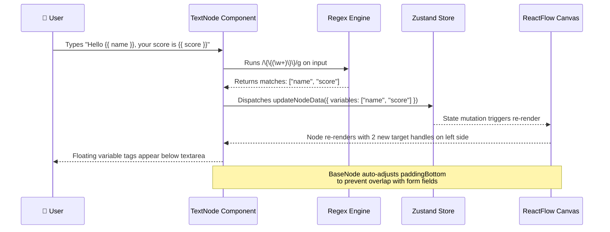
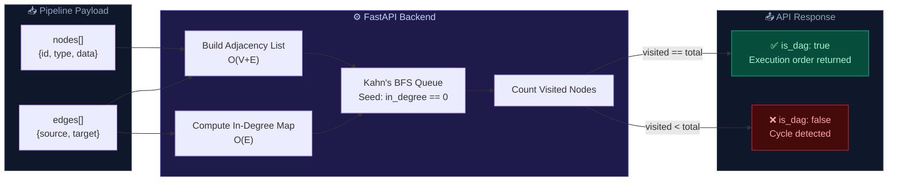
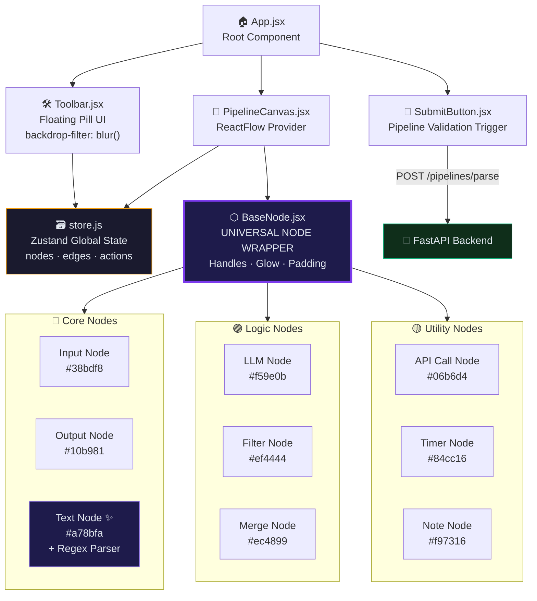

<div align="center">

<!-- Animated Header SVG -->
<svg width="900" height="180" viewBox="0 0 900 180" xmlns="http://www.w3.org/2000/svg">
  <defs>
    <linearGradient id="bgGrad" x1="0%" y1="0%" x2="100%" y2="100%">
      <stop offset="0%" style="stop-color:#0f0f1a;stop-opacity:1" />
      <stop offset="100%" style="stop-color:#1a0a2e;stop-opacity:1" />
    </linearGradient>
    <linearGradient id="titleGrad" x1="0%" y1="0%" x2="100%" y2="0%">
      <stop offset="0%" style="stop-color:#a78bfa" />
      <stop offset="50%" style="stop-color:#38bdf8" />
      <stop offset="100%" style="stop-color:#f472b6" />
    </linearGradient>
    <filter id="glow">
      <feGaussianBlur stdDeviation="3" result="coloredBlur"/>
      <feMerge>
        <feMergeNode in="coloredBlur"/>
        <feMergeNode in="SourceGraphic"/>
      </feMerge>
    </filter>
    <filter id="softGlow">
      <feGaussianBlur stdDeviation="8" result="coloredBlur"/>
      <feMerge>
        <feMergeNode in="coloredBlur"/>
        <feMergeNode in="SourceGraphic"/>
      </feMerge>
    </filter>
  </defs>

  <!-- Background -->
  <rect width="900" height="180" rx="16" fill="url(#bgGrad)" />

  <!-- Animated grid lines -->
  <line x1="0" y1="45" x2="900" y2="45" stroke="#ffffff08" stroke-width="1"/>
  <line x1="0" y1="90" x2="900" y2="90" stroke="#ffffff08" stroke-width="1"/>
  <line x1="0" y1="135" x2="900" y2="135" stroke="#ffffff08" stroke-width="1"/>
  <line x1="225" y1="0" x2="225" y2="180" stroke="#ffffff08" stroke-width="1"/>
  <line x1="450" y1="0" x2="450" y2="180" stroke="#ffffff08" stroke-width="1"/>
  <line x1="675" y1="0" x2="675" y2="180" stroke="#ffffff08" stroke-width="1"/>

  <!-- Glowing orbs -->
  <circle cx="120" cy="90" r="60" fill="#7c3aed" opacity="0.12" filter="url(#softGlow)"/>
  <circle cx="780" cy="90" r="60" fill="#0ea5e9" opacity="0.12" filter="url(#softGlow)"/>
  <circle cx="450" cy="90" r="80" fill="#ec4899" opacity="0.07" filter="url(#softGlow)"/>

  <!-- Animated pulse nodes -->
  <circle cx="80" cy="90" r="8" fill="#7c3aed" opacity="0.8" filter="url(#glow)">
    <animate attributeName="r" values="8;12;8" dur="2s" repeatCount="indefinite"/>
    <animate attributeName="opacity" values="0.8;0.4;0.8" dur="2s" repeatCount="indefinite"/>
  </circle>
  <circle cx="820" cy="90" r="8" fill="#38bdf8" opacity="0.8" filter="url(#glow)">
    <animate attributeName="r" values="8;12;8" dur="2.5s" repeatCount="indefinite"/>
    <animate attributeName="opacity" values="0.8;0.4;0.8" dur="2.5s" repeatCount="indefinite"/>
  </circle>
  <circle cx="450" cy="40" r="5" fill="#f472b6" opacity="0.8" filter="url(#glow)">
    <animate attributeName="r" values="5;8;5" dur="3s" repeatCount="indefinite"/>
  </circle>

  <!-- Animated connecting paths -->
  <path d="M 88 90 C 200 60, 350 60, 440 40" stroke="#a78bfa" stroke-width="1.5" fill="none" opacity="0.4" stroke-dasharray="6,4">
    <animate attributeName="stroke-dashoffset" values="0;-20" dur="1.5s" repeatCount="indefinite"/>
  </path>
  <path d="M 460 40 C 550 60, 700 60, 812 90" stroke="#38bdf8" stroke-width="1.5" fill="none" opacity="0.4" stroke-dasharray="6,4">
    <animate attributeName="stroke-dashoffset" values="0;-20" dur="1.5s" repeatCount="indefinite"/>
  </path>

  <!-- Main Title -->
  <text x="450" y="95" font-family="'Segoe UI', system-ui, sans-serif" font-size="42" font-weight="800"
        text-anchor="middle" fill="url(#titleGrad)" filter="url(#glow)">
    VectorShift Pipeline Editor
  </text>

  <!-- Subtitle -->
  <text x="450" y="130" font-family="'Segoe UI', system-ui, sans-serif" font-size="15" font-weight="400"
        text-anchor="middle" fill="#94a3b8" letter-spacing="3">
    VISUAL AI WORKFLOW BUILDER  ·  REACTFLOW  ·  FASTAPI  ·  DAG VALIDATION
  </text>

  <!-- Bottom accent line -->
  <line x1="200" y1="155" x2="700" y2="155" stroke="url(#titleGrad)" stroke-width="1" opacity="0.5"/>
</svg>

<br/>

[](https://reactjs.org/)
[](https://reactflow.dev/)
[](https://zustand-demo.pmnd.rs/)
[](https://fastapi.tiangolo.com/)
[](./LICENSE)

</div>

---

## 🌌 Overview

> *"This is what it looks like when someone refuses to write sloppy code."*

**VectorShift Pipeline Editor** is a production-grade, visual node-based workflow editor for building and validating **Generative AI pipelines**. Users drag and drop modular nodes onto an infinite canvas, wire them together with animated data-flow edges, configure their internal logic — and then submit the entire pipeline to a Python backend that runs a rigorous **topological sort (Kahn's Algorithm)** to validate the DAG structure before execution.

This isn't a tutorial clone. Every architectural decision — from the zero-boilerplate `BaseNode` abstraction to the real-time regex-powered variable extraction — was made with **scalability, maintainability, and pixel-perfect craft** at the forefront.

---

## ✨ Features

- 🏗️ **Zero-Boilerplate `BaseNode` Architecture** — A single declarative wrapper powers all 9 node types. New nodes require no UI code whatsoever.
- 🔁 **Kahn's Algorithm DAG Validation** — The FastAPI backend builds an adjacency list, computes in-degrees, and runs a BFS topological sort to detect cycles and validate pipeline integrity.
- ✍️ **Real-Time Regex Variable Parsing** — The `TextNode` dynamically spawns new input handles as the user types `{{ variable_name }}` syntax — live, with zero re-renders.
- 🎨 **Dark Glassmorphism Design System** — A bespoke CSS design system featuring `backdrop-filter: blur()`, radial gradient glows, animated dashed edges, and a floating pill-shaped toolbar.
- 🧠 **Zustand Global State** — A clean, flat Zustand store manages all node/edge mutations, selected node state, and pipeline submission — no prop drilling, no Redux boilerplate.
- 📦 **9 Production-Ready Nodes** spanning Core, Logic, and Utility categories.
- ⚡ **Animated Data-Flow Edges** — Dashed, animated edges visually indicate the direction and flow of data through the pipeline at a glance.
- 🔒 **Type-Safe Handle Management** — `source` and `target` handles are declaratively defined per-node and auto-positioned by `BaseNode`, preventing runtime wiring errors.

---

## 🏛️ System Architecture

### The Canvas & State Layer

```
┌─────────────────────────────────────────────────────────┐
│                    React Application                     │
│  ┌───────────────┐    ┌──────────────────────────────┐  │
│  │  Toolbar      │    │   ReactFlow Canvas            │  │
│  │  (Floating    │    │   ┌──────────────────────┐   │  │
│  │   Pill UI)    │    │   │  Nodes (via BaseNode) │   │  │
│  └───────────────┘    │   └──────────────────────┘   │  │
│          │            │   ┌──────────────────────┐   │  │
│          ▼            │   │  Animated Edges       │   │  │
│  ┌───────────────┐    │   └──────────────────────┘   │  │
│  │ Zustand Store │◄───┤   ┌──────────────────────┐   │  │
│  │ (Global State)│    │   │  MiniMap / Controls   │   │  │
│  └───────────────┘    │   └──────────────────────┘   │  │
│                       └──────────────────────────────┘  │
└─────────────────────────────────────────────────────────┘
```

---

### 🧩 The `BaseNode` Abstraction — The Heart of the System

Instead of maintaining 9 files with duplicated styling, handle logic, and hover states, the entire node system is powered by a **single `<BaseNode>` wrapper**.

```jsx
// Adding a brand-new node type requires ONLY this:
<BaseNode
  id={id}
  title="Custom AI Node"
  icon="🤖"
  accentColor="#a78bfa"
  handles={[
    { id: 'input',  type: 'target', position: 'left'  },
    { id: 'output', type: 'source', position: 'right' },
  ]}
  data={data}
>
  {/* Your node's internal form fields */}
</BaseNode>
```

`BaseNode` automatically:
- Applies gradient glow headers based on `accentColor`
- Computes dynamic `paddingBottom` to prevent form fields from overlapping floating variable tags
- Positions and renders all `handles[]` declaratively
- Applies hover animations, glass-card styling, and focus ring states

**Result:** Adding a new node to the system is purely a **data concern**, not a UI concern.

---

### 🔢 Kahn's Algorithm — DAG Validation on the Backend

The `/pipelines/parse` endpoint doesn't just echo back your payload. It performs real graph theory:

```python
# Pseudocode representation of the backend validation
def validate_dag(nodes, edges):
    in_degree = {node.id: 0 for node in nodes}
    adjacency = {node.id: [] for node in nodes}

    for edge in edges:
        adjacency[edge.source].append(edge.target)
        in_degree[edge.target] += 1

    # BFS queue seeded with all zero-in-degree nodes
    queue = [n for n in in_degree if in_degree[n] == 0]
    visited_count = 0

    while queue:
        node = queue.pop(0)
        visited_count += 1
        for neighbor in adjacency[node]:
            in_degree[neighbor] -= 1
            if in_degree[neighbor] == 0:
                queue.append(neighbor)

    # If visited_count != total nodes, a cycle exists
    return {
        "num_nodes": len(nodes),
        "num_edges": len(edges),
        "is_dag": visited_count == len(nodes)
    }
```

This approach is **O(V + E)** in time complexity — optimal for sparse AI pipeline graphs — and correctly handles disconnected subgraphs, self-loops, and complex multi-branch flows.

---

## 🔄 System Workflows

### Full Pipeline Lifecycle

```mermaid
flowchart TD
    A([🖥️ User Opens App]) --> B[ReactFlow Canvas Initializes]
    B --> C[Zustand Store Hydrates]
    C --> D{User Action}

    D -->|Drag from Toolbar| E[Node Dropped on Canvas]
    D -->|Click Existing Node| F[Node Selected → Config Panel Opens]
    D -->|Connect Handles| G[Edge Created → Zustand Updates]

    E --> H[BaseNode Renders with Declarative Props]
    H --> I[Handles Auto-Positioned]
    I --> J[Gradient Glow Header Applied]
    J --> D

    F --> K{Node Type?}
    K -->|TextNode| L[Regex Parser Watches Input]
    L --> M[{{ variables }} Detected → Handle Spawned]
    M --> D
    K -->|Other Nodes| N[Config Fields Updated in Store]
    N --> D

    G --> O[Animated Dashed Edge Renders]
    O --> D

    D -->|Submit Pipeline| P[Serialize Nodes + Edges as JSON]
    P --> Q[POST /pipelines/parse]
    Q --> R[FastAPI: Build Adjacency List + In-Degree Map]
    R --> S[Kahn's BFS Topological Sort]
    S --> T{Cycle Detected?}
    T -->|No| U[✅ is_dag: true → Success Toast]
    T -->|Yes| V[❌ is_dag: false → Error Alert]

    style A fill:#1e1b4b,stroke:#7c3aed,color:#e2e8f0
    style U fill:#064e3b,stroke:#10b981,color:#e2e8f0
    style V fill:#450a0a,stroke:#ef4444,color:#e2e8f0
    style H fill:#0c1a2e,stroke:#38bdf8,color:#e2e8f0
    style S fill:#1a1a2e,stroke:#a78bfa,color:#e2e8f0
```

---

### Dynamic Variable Extraction in TextNode



---

### DAG Validation Backend Flow



---

### Frontend Component Architecture



---

## 🧱 Nodes Overview

<!-- Animated Nodes Overview SVG -->
<div align="center">
<svg width="860" height="360" viewBox="0 0 860 360" xmlns="http://www.w3.org/2000/svg">
  <defs>
    <linearGradient id="cardBg" x1="0%" y1="0%" x2="100%" y2="100%">
      <stop offset="0%" style="stop-color:#111827"/>
      <stop offset="100%" style="stop-color:#0f172a"/>
    </linearGradient>
    <filter id="nodeGlow">
      <feGaussianBlur stdDeviation="4" result="coloredBlur"/>
      <feMerge><feMergeNode in="coloredBlur"/><feMergeNode in="SourceGraphic"/></feMerge>
    </filter>
    <!-- Category gradients -->
    <linearGradient id="coreGrad" x1="0%" y1="0%" x2="100%" y2="0%">
      <stop offset="0%" style="stop-color:#1e40af"/>
      <stop offset="100%" style="stop-color:#7c3aed"/>
    </linearGradient>
    <linearGradient id="logicGrad" x1="0%" y1="0%" x2="100%" y2="0%">
      <stop offset="0%" style="stop-color:#7c3aed"/>
      <stop offset="100%" style="stop-color:#db2777"/>
    </linearGradient>
    <linearGradient id="utilGrad" x1="0%" y1="0%" x2="100%" y2="0%">
      <stop offset="0%" style="stop-color:#b45309"/>
      <stop offset="100%" style="stop-color:#047857"/>
    </linearGradient>
  </defs>

  <!-- Background -->
  <rect width="860" height="360" rx="14" fill="#0a0a14"/>

  <!-- ── CORE NODES ── -->
  <text x="43" y="36" font-family="system-ui" font-size="11" fill="#64748b" letter-spacing="2" font-weight="600">CORE NODES</text>
  <line x1="40" y1="42" x2="280" y2="42" stroke="url(#coreGrad)" stroke-width="1.5" opacity="0.7"/>

  <!-- Input Node -->
  <rect x="40" y="52" width="220" height="80" rx="10" fill="url(#cardBg)" stroke="#38bdf8" stroke-width="1.2" opacity="0.9"/>
  <rect x="40" y="52" width="220" height="24" rx="10" fill="#38bdf8" opacity="0.18"/>
  <rect x="40" y="64" width="220" height="12" rx="0" fill="#38bdf8" opacity="0.18"/>
  <circle cx="56" cy="64" r="7" fill="#38bdf8" opacity="0.9" filter="url(#nodeGlow)"/>
  <text x="70" y="69" font-family="system-ui" font-size="12" font-weight="700" fill="#38bdf8">⬇  Input Node</text>
  <text x="56" y="100" font-family="system-ui" font-size="10" fill="#94a3b8">Accepts external data into the pipeline.</text>
  <text x="56" y="116" font-family="system-ui" font-size="10" fill="#94a3b8">Configurable name + data type selector.</text>
  <circle cx="260" cy="92" r="5" fill="#38bdf8" filter="url(#nodeGlow)">
    <animate attributeName="r" values="5;7;5" dur="2s" repeatCount="indefinite"/>
  </circle>

  <!-- Output Node -->
  <rect x="40" y="152" width="220" height="80" rx="10" fill="url(#cardBg)" stroke="#10b981" stroke-width="1.2" opacity="0.9"/>
  <rect x="40" y="152" width="220" height="24" rx="10" fill="#10b981" opacity="0.18"/>
  <rect x="40" y="164" width="220" height="12" rx="0" fill="#10b981" opacity="0.18"/>
  <circle cx="56" cy="164" r="7" fill="#10b981" opacity="0.9" filter="url(#nodeGlow)"/>
  <text x="70" y="169" font-family="system-ui" font-size="12" font-weight="700" fill="#10b981">⬆  Output Node</text>
  <text x="56" y="200" font-family="system-ui" font-size="10" fill="#94a3b8">Receives pipeline result. Configurable</text>
  <text x="56" y="216" font-family="system-ui" font-size="10" fill="#94a3b8">name + output type.</text>
  <circle cx="40" cy="192" r="5" fill="#10b981" filter="url(#nodeGlow)">
    <animate attributeName="r" values="5;7;5" dur="2.2s" repeatCount="indefinite"/>
  </circle>

  <!-- Text Node -->
  <rect x="40" y="252" width="220" height="88" rx="10" fill="url(#cardBg)" stroke="#a78bfa" stroke-width="1.5" opacity="0.9"/>
  <rect x="40" y="252" width="220" height="24" rx="10" fill="#a78bfa" opacity="0.2"/>
  <rect x="40" y="264" width="220" height="12" rx="0" fill="#a78bfa" opacity="0.2"/>
  <circle cx="56" cy="264" r="7" fill="#a78bfa" opacity="0.9" filter="url(#nodeGlow)"/>
  <text x="70" y="269" font-family="system-ui" font-size="12" font-weight="700" fill="#a78bfa">✍  Text Node</text>
  <text x="56" y="298" font-family="system-ui" font-size="10" fill="#94a3b8">Dynamic Regex parser. Detects</text>
  <text x="56" y="312" font-family="system-ui" font-size="10" fill="#94a3b8">{{ variables }} and spawns live handles.</text>
  <rect x="56" y="322" width="52" height="12" rx="6" fill="#a78bfa" opacity="0.25"/>
  <text x="82" y="331" font-family="system-ui" font-size="8" fill="#a78bfa" text-anchor="middle">✦ DYNAMIC</text>

  <!-- ── LOGIC NODES ── -->
  <text x="303" y="36" font-family="system-ui" font-size="11" fill="#64748b" letter-spacing="2" font-weight="600">LOGIC NODES</text>
  <line x1="300" y1="42" x2="560" y2="42" stroke="url(#logicGrad)" stroke-width="1.5" opacity="0.7"/>

  <!-- LLM Node -->
  <rect x="300" y="52" width="220" height="80" rx="10" fill="url(#cardBg)" stroke="#f59e0b" stroke-width="1.2" opacity="0.9"/>
  <rect x="300" y="52" width="220" height="24" rx="10" fill="#f59e0b" opacity="0.18"/>
  <rect x="300" y="64" width="220" height="12" rx="0" fill="#f59e0b" opacity="0.18"/>
  <circle cx="316" cy="64" r="7" fill="#f59e0b" opacity="0.9" filter="url(#nodeGlow)"/>
  <text x="330" y="69" font-family="system-ui" font-size="12" font-weight="700" fill="#f59e0b">🤖  LLM Node</text>
  <text x="316" y="100" font-family="system-ui" font-size="10" fill="#94a3b8">AI model invocation. Accepts system</text>
  <text x="316" y="116" font-family="system-ui" font-size="10" fill="#94a3b8">prompt + user prompt inputs.</text>

  <!-- Filter Node -->
  <rect x="300" y="152" width="220" height="80" rx="10" fill="url(#cardBg)" stroke="#ef4444" stroke-width="1.2" opacity="0.9"/>
  <rect x="300" y="152" width="220" height="24" rx="10" fill="#ef4444" opacity="0.18"/>
  <rect x="300" y="164" width="220" height="12" rx="0" fill="#ef4444" opacity="0.18"/>
  <circle cx="316" cy="164" r="7" fill="#ef4444" opacity="0.9" filter="url(#nodeGlow)"/>
  <text x="330" y="169" font-family="system-ui" font-size="12" font-weight="700" fill="#ef4444">🔍  Filter Node</text>
  <text x="316" y="200" font-family="system-ui" font-size="10" fill="#94a3b8">Conditional routing. Pass/fail logic</text>
  <text x="316" y="216" font-family="system-ui" font-size="10" fill="#94a3b8">based on configurable criteria.</text>

  <!-- Merge Node -->
  <rect x="300" y="252" width="220" height="80" rx="10" fill="url(#cardBg)" stroke="#ec4899" stroke-width="1.2" opacity="0.9"/>
  <rect x="300" y="252" width="220" height="24" rx="10" fill="#ec4899" opacity="0.18"/>
  <rect x="300" y="264" width="220" height="12" rx="0" fill="#ec4899" opacity="0.18"/>
  <circle cx="316" cy="264" r="7" fill="#ec4899" opacity="0.9" filter="url(#nodeGlow)"/>
  <text x="330" y="269" font-family="system-ui" font-size="12" font-weight="700" fill="#ec4899">⊕  Merge Node</text>
  <text x="316" y="300" font-family="system-ui" font-size="10" fill="#94a3b8">Combines multiple upstream inputs</text>
  <text x="316" y="316" font-family="system-ui" font-size="10" fill="#94a3b8">into a single downstream payload.</text>

  <!-- ── UTILITY NODES ── -->
  <text x="563" y="36" font-family="system-ui" font-size="11" fill="#64748b" letter-spacing="2" font-weight="600">UTILITY NODES</text>
  <line x1="560" y1="42" x2="820" y2="42" stroke="url(#utilGrad)" stroke-width="1.5" opacity="0.7"/>

  <!-- API Call Node -->
  <rect x="560" y="52" width="220" height="80" rx="10" fill="url(#cardBg)" stroke="#06b6d4" stroke-width="1.2" opacity="0.9"/>
  <rect x="560" y="52" width="220" height="24" rx="10" fill="#06b6d4" opacity="0.18"/>
  <rect x="560" y="64" width="220" height="12" rx="0" fill="#06b6d4" opacity="0.18"/>
  <circle cx="576" cy="64" r="7" fill="#06b6d4" opacity="0.9" filter="url(#nodeGlow)"/>
  <text x="590" y="69" font-family="system-ui" font-size="12" font-weight="700" fill="#06b6d4">🌐  API Call Node</text>
  <text x="576" y="100" font-family="system-ui" font-size="10" fill="#94a3b8">HTTP request executor. Configurable</text>
  <text x="576" y="116" font-family="system-ui" font-size="10" fill="#94a3b8">method, URL, and headers.</text>

  <!-- Timer Node -->
  <rect x="560" y="152" width="220" height="80" rx="10" fill="url(#cardBg)" stroke="#84cc16" stroke-width="1.2" opacity="0.9"/>
  <rect x="560" y="152" width="220" height="24" rx="10" fill="#84cc16" opacity="0.18"/>
  <rect x="560" y="164" width="220" height="12" rx="0" fill="#84cc16" opacity="0.18"/>
  <circle cx="576" cy="164" r="7" fill="#84cc16" opacity="0.9" filter="url(#nodeGlow)"/>
  <text x="590" y="169" font-family="system-ui" font-size="12" font-weight="700" fill="#84cc16">⏱  Timer Node</text>
  <text x="576" y="200" font-family="system-ui" font-size="10" fill="#94a3b8">Introduces configurable time delays</text>
  <text x="576" y="216" font-family="system-ui" font-size="10" fill="#94a3b8">or scheduled triggers into the flow.</text>

  <!-- Note Node -->
  <rect x="560" y="252" width="220" height="80" rx="10" fill="url(#cardBg)" stroke="#f97316" stroke-width="1.2" opacity="0.9"/>
  <rect x="560" y="252" width="220" height="24" rx="10" fill="#f97316" opacity="0.18"/>
  <rect x="560" y="264" width="220" height="12" rx="0" fill="#f97316" opacity="0.18"/>
  <circle cx="576" cy="264" r="7" fill="#f97316" opacity="0.9" filter="url(#nodeGlow)"/>
  <text x="590" y="269" font-family="system-ui" font-size="12" font-weight="700" fill="#f97316">📝  Note Node</text>
  <text x="576" y="300" font-family="system-ui" font-size="10" fill="#94a3b8">Non-functional annotation. Free-text</text>
  <text x="576" y="316" font-family="system-ui" font-size="10" fill="#94a3b8">comments for pipeline documentation.</text>
</svg>
</div>

---

## 📂 Project Structure

```
vectorshift-frontend-assessment/
│
├── 📁 frontend/                    # React Application
│   ├── 📁 src/
│   │   ├── 📁 nodes/
│   │   │   ├── BaseNode.jsx        # ⭐ Universal node wrapper (zero-boilerplate)
│   │   │   ├── InputNode.jsx
│   │   │   ├── OutputNode.jsx
│   │   │   ├── TextNode.jsx        # ✨ Regex-powered dynamic variables
│   │   │   ├── LLMNode.jsx
│   │   │   ├── FilterNode.jsx
│   │   │   ├── MergeNode.jsx
│   │   │   ├── APICallNode.jsx
│   │   │   ├── TimerNode.jsx
│   │   │   └── NoteNode.jsx
│   │   ├── PipelineCanvas.jsx      # ReactFlow provider + canvas config
│   │   ├── Toolbar.jsx             # Floating glassmorphic pill toolbar
│   │   ├── SubmitButton.jsx        # Pipeline serialization + API call
│   │   ├── store.js                # Zustand global state
│   │   └── App.jsx                 # Root component
│   └── package.json
│
├── 📁 backend/                     # FastAPI Application
│   ├── main.py                     # App entry + CORS config
│   ├── routes/
│   │   └── pipeline.py             # /pipelines/parse endpoint
│   ├── models/
│   │   └── graph.py                # Pydantic request models
│   ├── services/
│   │   └── dag_validator.py        # ⭐ Kahn's Algorithm implementation
│   └── requirements.txt
│
└── README.md
```

---

## 🚀 Getting Started

### Prerequisites

- **Node.js** `v18+` and **npm** `v9+`
- **Python** `3.10+` and **pip**

---

### 1️⃣ Backend — FastAPI Server

```bash
# Navigate to the backend directory
cd backend

# Create and activate a virtual environment (recommended)
python -m venv venv
source venv/bin/activate       # macOS/Linux
# venv\Scripts\activate        # Windows

# Install dependencies
pip install -r requirements.txt

# Start the FastAPI development server on port 8000
uvicorn main:app --reload --port 8000
```

> ✅ Backend running at: `http://localhost:8000`
> 📄 Interactive API docs at: `http://localhost:8000/docs`

---

### 2️⃣ Frontend — React App

```bash
# In a new terminal, navigate to the frontend directory
cd frontend

# Install all npm dependencies
npm install

# Start the React development server
npm start
```

> ✅ App running at: `http://localhost:3000`

---

### API Contract

**`POST /pipelines/parse`**

```json
// Request Body
{
  "nodes": [
    { "id": "input-1", "type": "customInput" },
    { "id": "llm-1",   "type": "llm"         },
    { "id": "output-1","type": "customOutput" }
  ],
  "edges": [
    { "source": "input-1",  "target": "llm-1"    },
    { "source": "llm-1",    "target": "output-1" }
  ]
}

// Response Body
{
  "num_nodes": 3,
  "num_edges": 2,
  "is_dag": true
}
```

---

## 🎨 Design System

| Token | Value | Usage |
|---|---|---|
| `--surface-primary` | `#111827` | Node card backgrounds |
| `--surface-secondary` | `#0f172a` | Canvas background |
| `--accent-core` | `#38bdf8` | Input/Output node headers |
| `--accent-intelligence` | `#a78bfa` | Text/LLM node headers |
| `--accent-danger` | `#ef4444` | Filter node, error states |
| `--glass-blur` | `blur(16px)` | Toolbar, overlay elements |
| `--font-primary` | `Inter` | UI text, labels |
| `--font-display` | `Playfair Display` | Headers, titles |

---

## 🧪 Testing the Validation

**Valid DAG — Linear Pipeline:**
```
[Input] ──→ [LLM] ──→ [Filter] ──→ [Output]
```
Response: `{ "is_dag": true }`

**Valid DAG — Branching Pipeline:**
```
[Input] ──→ [LLM] ──→ [Output A]
              └──→ [Filter] ──→ [Output B]
```
Response: `{ "is_dag": true }`

**Invalid — Cycle Detected:**
```
[Node A] ──→ [Node B] ──→ [Node C] ──→ [Node A]  ← cycle!
```
Response: `{ "is_dag": false }`

---

## 📜 License

Released under the [MIT License](./LICENSE). Built with ❤️ as a technical assessment for [VectorShift](https://vectorshift.ai).

---

<div align="center">

<!-- Footer SVG -->
<svg width="600" height="60" viewBox="0 0 600 60" xmlns="http://www.w3.org/2000/svg">
  <defs>
    <linearGradient id="footerGrad" x1="0%" y1="0%" x2="100%" y2="0%">
      <stop offset="0%" style="stop-color:#7c3aed;stop-opacity:0"/>
      <stop offset="30%" style="stop-color:#a78bfa;stop-opacity:1"/>
      <stop offset="70%" style="stop-color:#38bdf8;stop-opacity:1"/>
      <stop offset="100%" style="stop-color:#38bdf8;stop-opacity:0"/>
    </linearGradient>
  </defs>
  <line x1="0" y1="1" x2="600" y2="1" stroke="url(#footerGrad)" stroke-width="1"/>
  <text x="300" y="35" font-family="system-ui" font-size="12" fill="#475569" text-anchor="middle">
    Built by Dev Chiniwala · VectorShift Frontend Assessment · 2025
  </text>
  <line x1="0" y1="59" x2="600" y2="59" stroke="url(#footerGrad)" stroke-width="1"/>
</svg>

</div>
