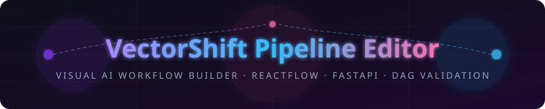
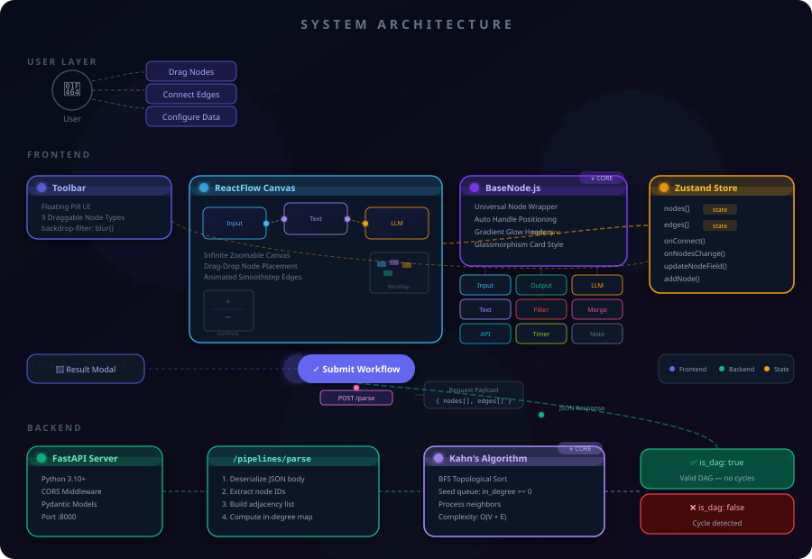
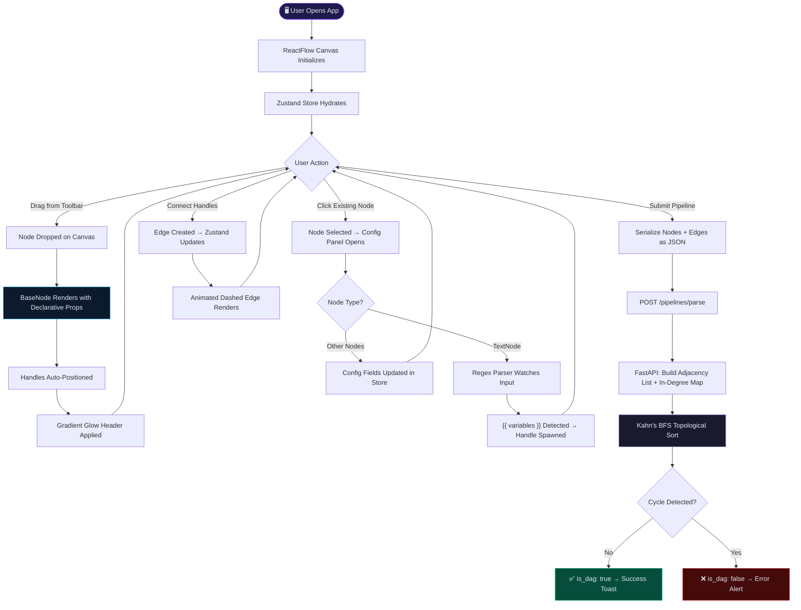
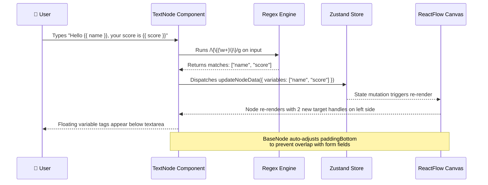
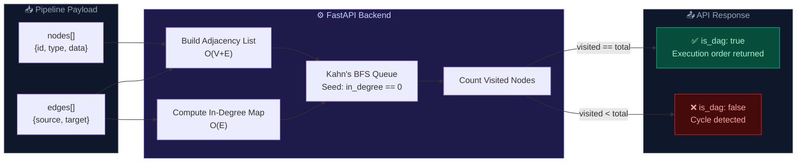
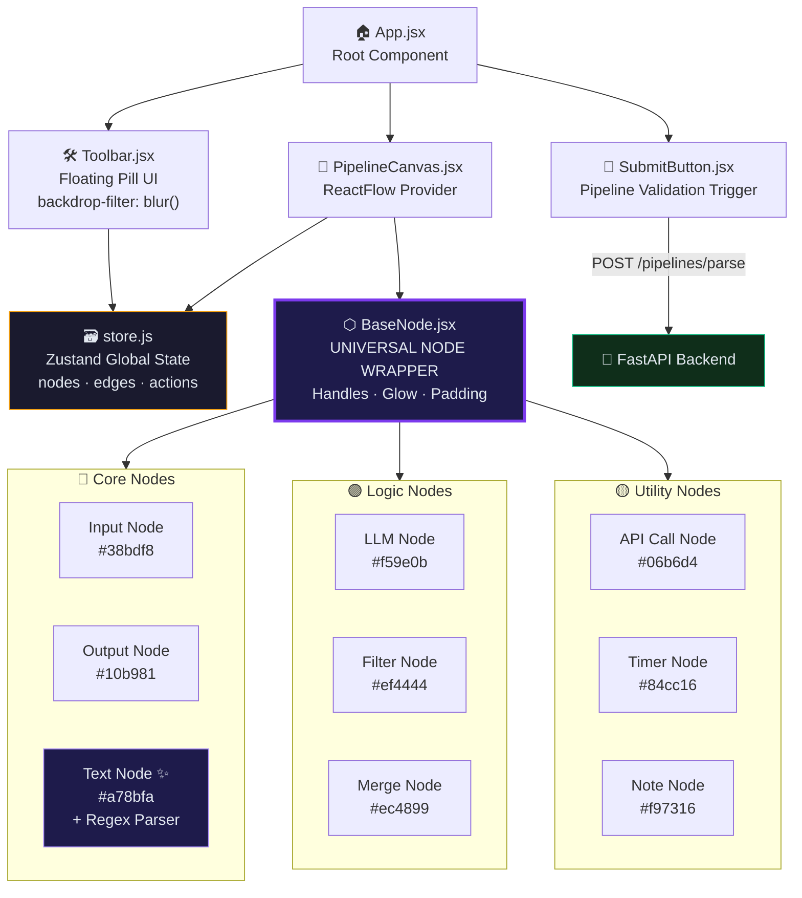
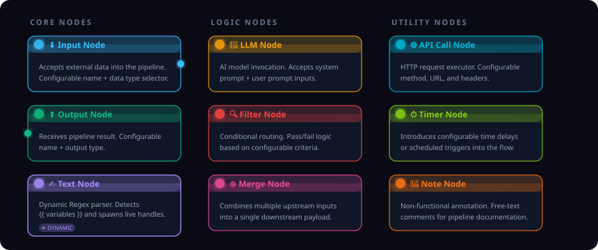

<div align="center">

<!-- Animated Header SVG -->


<br/>

[](https://reactjs.org/)
[](https://reactflow.dev/)
[](https://zustand-demo.pmnd.rs/)
[](https://fastapi.tiangolo.com/)
[](./LICENSE)

</div>

---

## 🌌 Overview

> *"This is what it looks like when someone refuses to write sloppy code."*

**VectorShift Pipeline Editor** is a production-grade, visual node-based workflow editor for building and validating **Generative AI pipelines**. Users drag and drop modular nodes onto an infinite canvas, wire them together with animated data-flow edges, configure their internal logic — and then submit the entire pipeline to a Python backend that runs a rigorous **topological sort (Kahn's Algorithm)** to validate the DAG structure before execution.

This isn't a tutorial clone. Every architectural decision — from the zero-boilerplate `BaseNode` abstraction to the real-time regex-powered variable extraction — was made with **scalability, maintainability, and pixel-perfect craft** at the forefront.

---

## ✨ Features

- 🏗️ **Zero-Boilerplate `BaseNode` Architecture** — A single declarative wrapper powers all 9 node types. New nodes require no UI code whatsoever.
- 🔁 **Kahn's Algorithm & Connected Components** — The FastAPI backend computes in-degrees to detect cycles (DAG), and runs a BFS to validate that the graph is fully connected (no orphaned nodes).
- ✍️ **Real-Time Regex Variable Parsing** — The `TextNode` dynamically spawns new input handles as the user types `{{ variable_name }}` syntax — live, with zero re-renders.
- 🧹 **Automatic Dangling Edge Cleanup** — If a user deletes a `{{variable}}`, the system automatically detects the missing handle and purges any connected edges to prevent state corruption.
- 🎨 **Dark Glassmorphism Design System** — A bespoke CSS design system featuring `backdrop-filter: blur()`, radial gradient glows, animated dashed edges, and a floating pill-shaped toolbar.
- 🧠 **Zustand Global State** — A clean, flat Zustand store manages all node/edge mutations, selected node state, and pipeline submission — no prop drilling, no Redux boilerplate.
- 📦 **9 Production-Ready Nodes** spanning Core, Logic, and Utility categories.
- ⚡ **Animated Data-Flow Edges** — Dashed, animated edges visually indicate the direction and flow of data through the pipeline at a glance.
- 🔒 **Type-Safe Handle Management** — `source` and `target` handles are declaratively defined per-node and auto-positioned by `BaseNode`, preventing runtime wiring errors.

---

### Interactive Architecture Diagram

<div align="center">

</div>

---

### 🧩 The `BaseNode` Abstraction — The Heart of the System

Instead of maintaining 9 files with duplicated styling, handle logic, and hover states, the entire node system is powered by a **single `<BaseNode>` wrapper**.

```jsx
// Adding a brand-new node type requires ONLY this:
<BaseNode
  id={id}
  title="Custom AI Node"
  icon="🤖"
  accentColor="#a78bfa"
  handles={[
    { id: 'input',  type: 'target', position: 'left'  },
    { id: 'output', type: 'source', position: 'right' },
  ]}
  data={data}
>
  {/* Your node's internal form fields */}
</BaseNode>
```

`BaseNode` automatically:
- Applies gradient glow headers based on `accentColor`
- Computes dynamic `paddingBottom` to prevent form fields from overlapping floating variable tags
- Positions and renders all `handles[]` declaratively
- Applies hover animations, glass-card styling, and focus ring states

**Result:** Adding a new node to the system is purely a **data concern**, not a UI concern.

---

### 🔢 Kahn's Algorithm — DAG Validation on the Backend

The `/pipelines/parse` endpoint doesn't just echo back your payload. It performs real graph theory:

```python
# Pseudocode representation of the backend validation
def validate_dag(nodes, edges):
    in_degree = {node.id: 0 for node in nodes}
    adjacency = {node.id: [] for node in nodes}

    for edge in edges:
        adjacency[edge.source].append(edge.target)
        in_degree[edge.target] += 1

    # BFS queue seeded with all zero-in-degree nodes
    queue = [n for n in in_degree if in_degree[n] == 0]
    visited_count = 0

    while queue:
        node = queue.pop(0)
        visited_count += 1
        for neighbor in adjacency[node]:
            in_degree[neighbor] -= 1
            if in_degree[neighbor] == 0:
                queue.append(neighbor)

    # If visited_count != total nodes, a cycle exists
    return {
        "num_nodes": len(nodes),
        "num_edges": len(edges),
        "is_dag": visited_count == len(nodes)
    }
```

This approach is **O(V + E)** in time complexity — optimal for sparse AI pipeline graphs — and correctly handles disconnected subgraphs, self-loops, and complex multi-branch flows.

---

## 🔄 System Workflows

### Full Pipeline Lifecycle



---

### Dynamic Variable Extraction in TextNode



---

### DAG Validation Backend Flow



---

### Frontend Component Architecture



---

## 🧱 Nodes Overview

<!-- Animated Nodes Overview SVG -->
<div align="center">

</div>

---

## 📂 Project Structure

```
vectorshift-frontend-assessment/
│
├── 📁 frontend/                    # React Application
│   ├── 📁 src/
│   │   ├── 📁 nodes/
│   │   │   ├── BaseNode.jsx        # ⭐ Universal node wrapper (zero-boilerplate)
│   │   │   ├── InputNode.jsx
│   │   │   ├── OutputNode.jsx
│   │   │   ├── TextNode.jsx        # ✨ Regex-powered dynamic variables
│   │   │   ├── LLMNode.jsx
│   │   │   ├── FilterNode.jsx
│   │   │   ├── MergeNode.jsx
│   │   │   ├── APICallNode.jsx
│   │   │   ├── TimerNode.jsx
│   │   │   └── NoteNode.jsx
│   │   ├── PipelineCanvas.jsx      # ReactFlow provider + canvas config
│   │   ├── Toolbar.jsx             # Floating glassmorphic pill toolbar
│   │   ├── SubmitButton.jsx        # Pipeline serialization + API call
│   │   ├── store.js                # Zustand global state
│   │   └── App.jsx                 # Root component
│   └── package.json
│
├── 📁 backend/                     # FastAPI Application
│   ├── main.py                     # App entry + CORS config
│   ├── routes/
│   │   └── pipeline.py             # /pipelines/parse endpoint
│   ├── models/
│   │   └── graph.py                # Pydantic request models
│   ├── services/
│   │   └── dag_validator.py        # ⭐ Kahn's Algorithm implementation
│   └── requirements.txt
│
└── README.md
```

---

## 🚀 Getting Started

### Prerequisites

- **Node.js** `v18+` and **npm** `v9+`
- **Python** `3.10+` and **pip**

---

### 1️⃣ Backend — FastAPI Server

```bash
# Navigate to the backend directory
cd backend

# Create and activate a virtual environment (recommended)
python -m venv venv
source venv/bin/activate       # macOS/Linux
# venv\Scripts\activate        # Windows

# Install dependencies
pip install -r requirements.txt

# Start the FastAPI development server on port 8000
uvicorn main:app --reload --port 8000
```

> ✅ Backend running at: `http://localhost:8000`
> 📄 Interactive API docs at: `http://localhost:8000/docs`

---

### 2️⃣ Frontend — React App

```bash
# In a new terminal, navigate to the frontend directory
cd frontend

# Install all npm dependencies
npm install

# Start the React development server
npm start
```

> ✅ App running at: `http://localhost:3000`

---

### API Contract

**`POST /pipelines/parse`**

```json
// Request Body
{
  "nodes": [
    { "id": "input-1", "type": "customInput" },
    { "id": "llm-1",   "type": "llm"         },
    { "id": "output-1","type": "customOutput" }
  ],
  "edges": [
    { "source": "input-1",  "target": "llm-1"    },
    { "source": "llm-1",    "target": "output-1" }
  ]
}

// Response Body
{
  "num_nodes": 3,
  "num_edges": 2,
  "is_dag": true
}
```

---

## 🎨 Design System

| Token | Value | Usage |
|---|---|---|
| `--surface-primary` | `#111827` | Node card backgrounds |
| `--surface-secondary` | `#0f172a` | Canvas background |
| `--accent-core` | `#38bdf8` | Input/Output node headers |
| `--accent-intelligence` | `#a78bfa` | Text/LLM node headers |
| `--accent-danger` | `#ef4444` | Filter node, error states |
| `--glass-blur` | `blur(16px)` | Toolbar, overlay elements |
| `--font-primary` | `Inter` | UI text, labels |
| `--font-display` | `Playfair Display` | Headers, titles |

---

## 🧪 Testing the Validation

**Valid DAG — Linear Pipeline:**
```
[Input] ──→ [LLM] ──→ [Filter] ──→ [Output]
```
Response: `{ "is_dag": true }`

**Valid DAG — Branching Pipeline:**
```
[Input] ──→ [LLM] ──→ [Output A]
              └──→ [Filter] ──→ [Output B]
```
Response: `{ "is_dag": true }`

**Invalid — Cycle Detected:**
```
[Node A] ──→ [Node B] ──→ [Node C] ──→ [Node A]  ← cycle!
```
Response: `{ "is_dag": false }`

---

## 📜 License

Released under the [MIT License](./LICENSE). Built with ❤️ as a technical assessment for [VectorShift](https://vectorshift.ai).

---

<div align="center">

<!-- Footer SVG -->


</div>
