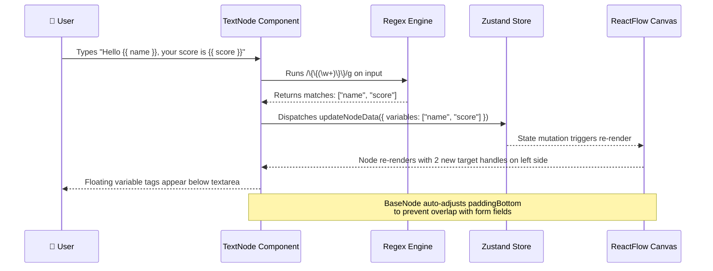
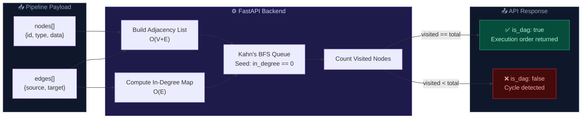
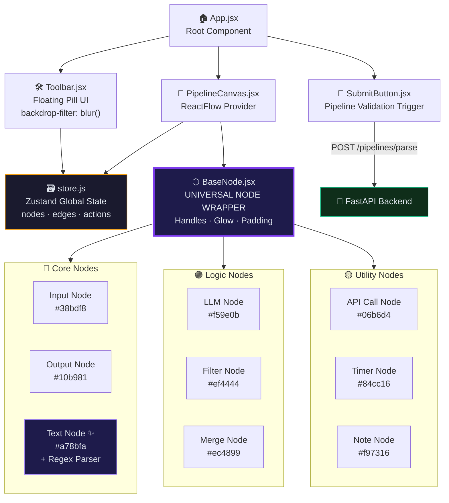

<div align="center">

<!-- Animated Header SVG -->
<svg width="900" height="180" viewBox="0 0 900 180" xmlns="http://www.w3.org/2000/svg">
  <defs>
    <linearGradient id="bgGrad" x1="0%" y1="0%" x2="100%" y2="100%">
      <stop offset="0%" style="stop-color:#0f0f1a;stop-opacity:1" />
      <stop offset="100%" style="stop-color:#1a0a2e;stop-opacity:1" />
    </linearGradient>
    <linearGradient id="titleGrad" x1="0%" y1="0%" x2="100%" y2="0%">
      <stop offset="0%" style="stop-color:#a78bfa" />
      <stop offset="50%" style="stop-color:#38bdf8" />
      <stop offset="100%" style="stop-color:#f472b6" />
    </linearGradient>
    <filter id="glow">
      <feGaussianBlur stdDeviation="3" result="coloredBlur"/>
      <feMerge>
        <feMergeNode in="coloredBlur"/>
        <feMergeNode in="SourceGraphic"/>
      </feMerge>
    </filter>
    <filter id="softGlow">
      <feGaussianBlur stdDeviation="8" result="coloredBlur"/>
      <feMerge>
        <feMergeNode in="coloredBlur"/>
        <feMergeNode in="SourceGraphic"/>
      </feMerge>
    </filter>
  </defs>

  <!-- Background -->
  <rect width="900" height="180" rx="16" fill="url(#bgGrad)" />

  <!-- Animated grid lines -->
  <line x1="0" y1="45" x2="900" y2="45" stroke="#ffffff08" stroke-width="1"/>
  <line x1="0" y1="90" x2="900" y2="90" stroke="#ffffff08" stroke-width="1"/>
  <line x1="0" y1="135" x2="900" y2="135" stroke="#ffffff08" stroke-width="1"/>
  <line x1="225" y1="0" x2="225" y2="180" stroke="#ffffff08" stroke-width="1"/>
  <line x1="450" y1="0" x2="450" y2="180" stroke="#ffffff08" stroke-width="1"/>
  <line x1="675" y1="0" x2="675" y2="180" stroke="#ffffff08" stroke-width="1"/>

  <!-- Glowing orbs -->
  <circle cx="120" cy="90" r="60" fill="#7c3aed" opacity="0.12" filter="url(#softGlow)"/>
  <circle cx="780" cy="90" r="60" fill="#0ea5e9" opacity="0.12" filter="url(#softGlow)"/>
  <circle cx="450" cy="90" r="80" fill="#ec4899" opacity="0.07" filter="url(#softGlow)"/>

  <!-- Animated pulse nodes -->
  <circle cx="80" cy="90" r="8" fill="#7c3aed" opacity="0.8" filter="url(#glow)">
    <animate attributeName="r" values="8;12;8" dur="2s" repeatCount="indefinite"/>
    <animate attributeName="opacity" values="0.8;0.4;0.8" dur="2s" repeatCount="indefinite"/>
  </circle>
  <circle cx="820" cy="90" r="8" fill="#38bdf8" opacity="0.8" filter="url(#glow)">
    <animate attributeName="r" values="8;12;8" dur="2.5s" repeatCount="indefinite"/>
    <animate attributeName="opacity" values="0.8;0.4;0.8" dur="2.5s" repeatCount="indefinite"/>
  </circle>
  <circle cx="450" cy="40" r="5" fill="#f472b6" opacity="0.8" filter="url(#glow)">
    <animate attributeName="r" values="5;8;5" dur="3s" repeatCount="indefinite"/>
  </circle>

  <!-- Animated connecting paths -->
  <path d="M 88 90 C 200 60, 350 60, 440 40" stroke="#a78bfa" stroke-width="1.5" fill="none" opacity="0.4" stroke-dasharray="6,4">
    <animate attributeName="stroke-dashoffset" values="0;-20" dur="1.5s" repeatCount="indefinite"/>
  </path>
  <path d="M 460 40 C 550 60, 700 60, 812 90" stroke="#38bdf8" stroke-width="1.5" fill="none" opacity="0.4" stroke-dasharray="6,4">
    <animate attributeName="stroke-dashoffset" values="0;-20" dur="1.5s" repeatCount="indefinite"/>
  </path>

  <!-- Main Title -->
  <text x="450" y="95" font-family="'Segoe UI', system-ui, sans-serif" font-size="42" font-weight="800"
        text-anchor="middle" fill="url(#titleGrad)" filter="url(#glow)">
    VectorShift Pipeline Editor
  </text>

  <!-- Subtitle -->
  <text x="450" y="130" font-family="'Segoe UI', system-ui, sans-serif" font-size="15" font-weight="400"
        text-anchor="middle" fill="#94a3b8" letter-spacing="3">
    VISUAL AI WORKFLOW BUILDER  ·  REACTFLOW  ·  FASTAPI  ·  DAG VALIDATION
  </text>

  <!-- Bottom accent line -->
  <line x1="200" y1="155" x2="700" y2="155" stroke="url(#titleGrad)" stroke-width="1" opacity="0.5"/>
</svg>

<br/>

[](https://reactjs.org/)
[](https://reactflow.dev/)
[](https://zustand-demo.pmnd.rs/)
[](https://fastapi.tiangolo.com/)
[](./LICENSE)

</div>

---

## 🌌 Overview

> *"This is what it looks like when someone refuses to write sloppy code."*

**VectorShift Pipeline Editor** is a production-grade, visual node-based workflow editor for building and validating **Generative AI pipelines**. Users drag and drop modular nodes onto an infinite canvas, wire them together with animated data-flow edges, configure their internal logic — and then submit the entire pipeline to a Python backend that runs a rigorous **topological sort (Kahn's Algorithm)** to validate the DAG structure before execution.

This isn't a tutorial clone. Every architectural decision — from the zero-boilerplate `BaseNode` abstraction to the real-time regex-powered variable extraction — was made with **scalability, maintainability, and pixel-perfect craft** at the forefront.

---

## ✨ Features

- 🏗️ **Zero-Boilerplate `BaseNode` Architecture** — A single declarative wrapper powers all 9 node types. New nodes require no UI code whatsoever.
- 🔁 **Kahn's Algorithm DAG Validation** — The FastAPI backend builds an adjacency list, computes in-degrees, and runs a BFS topological sort to detect cycles and validate pipeline integrity.
- ✍️ **Real-Time Regex Variable Parsing** — The `TextNode` dynamically spawns new input handles as the user types `{{ variable_name }}` syntax — live, with zero re-renders.
- 🎨 **Dark Glassmorphism Design System** — A bespoke CSS design system featuring `backdrop-filter: blur()`, radial gradient glows, animated dashed edges, and a floating pill-shaped toolbar.
- 🧠 **Zustand Global State** — A clean, flat Zustand store manages all node/edge mutations, selected node state, and pipeline submission — no prop drilling, no Redux boilerplate.
- 📦 **9 Production-Ready Nodes** spanning Core, Logic, and Utility categories.
- ⚡ **Animated Data-Flow Edges** — Dashed, animated edges visually indicate the direction and flow of data through the pipeline at a glance.
- 🔒 **Type-Safe Handle Management** — `source` and `target` handles are declaratively defined per-node and auto-positioned by `BaseNode`, preventing runtime wiring errors.

---

### Interactive Architecture Diagram

<div align="center">
<svg width="900" height="620" viewBox="0 0 900 620" xmlns="http://www.w3.org/2000/svg">
  <defs>
    <!-- Gradients -->
    <linearGradient id="archBg" x1="0%" y1="0%" x2="100%" y2="100%">
      <stop offset="0%" style="stop-color:#080c18"/>
      <stop offset="100%" style="stop-color:#0f0a1e"/>
    </linearGradient>
    <linearGradient id="frontendGrad" x1="0%" y1="0%" x2="100%" y2="0%">
      <stop offset="0%" style="stop-color:#6366f1"/>
      <stop offset="100%" style="stop-color:#38bdf8"/>
    </linearGradient>
    <linearGradient id="backendGrad" x1="0%" y1="0%" x2="100%" y2="0%">
      <stop offset="0%" style="stop-color:#10b981"/>
      <stop offset="100%" style="stop-color:#059669"/>
    </linearGradient>
    <linearGradient id="storeGrad" x1="0%" y1="0%" x2="0%" y2="100%">
      <stop offset="0%" style="stop-color:#f59e0b"/>
      <stop offset="100%" style="stop-color:#d97706"/>
    </linearGradient>
    <linearGradient id="dataFlowGrad" x1="0%" y1="0%" x2="100%" y2="0%">
      <stop offset="0%" style="stop-color:#a78bfa"/>
      <stop offset="100%" style="stop-color:#38bdf8"/>
    </linearGradient>
    <linearGradient id="httpGrad" x1="0%" y1="0%" x2="0%" y2="100%">
      <stop offset="0%" style="stop-color:#f472b6"/>
      <stop offset="100%" style="stop-color:#ec4899"/>
    </linearGradient>
    <linearGradient id="nodeAreaGrad" x1="0%" y1="0%" x2="100%" y2="100%">
      <stop offset="0%" style="stop-color:#1e1b4b;stop-opacity:0.5"/>
      <stop offset="100%" style="stop-color:#0f172a;stop-opacity:0.5"/>
    </linearGradient>

    <!-- Filters -->
    <filter id="archGlow">
      <feGaussianBlur stdDeviation="3" result="coloredBlur"/>
      <feMerge><feMergeNode in="coloredBlur"/><feMergeNode in="SourceGraphic"/></feMerge>
    </filter>
    <filter id="archSoftGlow">
      <feGaussianBlur stdDeviation="6" result="coloredBlur"/>
      <feMerge><feMergeNode in="coloredBlur"/><feMergeNode in="SourceGraphic"/></feMerge>
    </filter>
    <filter id="shadowFilter">
      <feDropShadow dx="0" dy="4" stdDeviation="8" flood-color="#000000" flood-opacity="0.5"/>
    </filter>
  </defs>

  <!-- ═══ BACKGROUND ═══ -->
  <rect width="900" height="620" rx="16" fill="url(#archBg)"/>

  <!-- Subtle grid -->
  <line x1="0" y1="100" x2="900" y2="100" stroke="#ffffff04" stroke-width="1"/>
  <line x1="0" y1="200" x2="900" y2="200" stroke="#ffffff04" stroke-width="1"/>
  <line x1="0" y1="300" x2="900" y2="300" stroke="#ffffff04" stroke-width="1"/>
  <line x1="0" y1="400" x2="900" y2="400" stroke="#ffffff04" stroke-width="1"/>
  <line x1="0" y1="500" x2="900" y2="500" stroke="#ffffff04" stroke-width="1"/>
  <line x1="150" y1="0" x2="150" y2="620" stroke="#ffffff04" stroke-width="1"/>
  <line x1="300" y1="0" x2="300" y2="620" stroke="#ffffff04" stroke-width="1"/>
  <line x1="450" y1="0" x2="450" y2="620" stroke="#ffffff04" stroke-width="1"/>
  <line x1="600" y1="0" x2="600" y2="620" stroke="#ffffff04" stroke-width="1"/>
  <line x1="750" y1="0" x2="750" y2="620" stroke="#ffffff04" stroke-width="1"/>

  <!-- Background orbs -->
  <circle cx="200" cy="200" r="120" fill="#6366f1" opacity="0.04" filter="url(#archSoftGlow)"/>
  <circle cx="700" cy="200" r="100" fill="#38bdf8" opacity="0.04" filter="url(#archSoftGlow)"/>
  <circle cx="450" cy="500" r="140" fill="#10b981" opacity="0.03" filter="url(#archSoftGlow)"/>

  <!-- ═══ TITLE ═══ -->
  <text x="450" y="32" font-family="'Segoe UI', system-ui, sans-serif" font-size="14" font-weight="700" text-anchor="middle" fill="#64748b" letter-spacing="4">SYSTEM ARCHITECTURE</text>
  <line x1="300" y1="40" x2="600" y2="40" stroke="url(#frontendGrad)" stroke-width="1" opacity="0.4"/>

  <!-- ═══ LAYER 1: USER INTERACTION ═══ -->
  <text x="30" y="72" font-family="system-ui" font-size="10" fill="#475569" letter-spacing="2" font-weight="600">USER LAYER</text>

  <!-- User Icon -->
  <circle cx="80" cy="100" r="22" fill="none" stroke="#64748b" stroke-width="1.5" opacity="0.6"/>
  <text x="80" y="105" font-family="system-ui" font-size="18" text-anchor="middle" fill="#94a3b8">👤</text>
  <text x="80" y="135" font-family="system-ui" font-size="9" text-anchor="middle" fill="#64748b">User</text>

  <!-- Action arrows from user -->
  <path d="M 102 90 C 130 85, 145 80, 160 80" stroke="#64748b" stroke-width="1" fill="none" stroke-dasharray="4,3" opacity="0.6">
    <animate attributeName="stroke-dashoffset" values="0;-14" dur="2s" repeatCount="indefinite"/>
  </path>
  <path d="M 102 100 C 130 100, 145 100, 160 100" stroke="#64748b" stroke-width="1" fill="none" stroke-dasharray="4,3" opacity="0.6">
    <animate attributeName="stroke-dashoffset" values="0;-14" dur="2s" repeatCount="indefinite"/>
  </path>
  <path d="M 102 110 C 130 115, 145 120, 160 120" stroke="#64748b" stroke-width="1" fill="none" stroke-dasharray="4,3" opacity="0.6">
    <animate attributeName="stroke-dashoffset" values="0;-14" dur="2s" repeatCount="indefinite"/>
  </path>

  <!-- User actions -->
  <rect x="162" y="68" width="100" height="22" rx="6" fill="#1e1b4b" stroke="#6366f1" stroke-width="0.8" opacity="0.9"/>
  <text x="212" y="83" font-family="system-ui" font-size="9" text-anchor="middle" fill="#a5b4fc">Drag Nodes</text>

  <rect x="162" y="93" width="100" height="22" rx="6" fill="#1e1b4b" stroke="#6366f1" stroke-width="0.8" opacity="0.9"/>
  <text x="212" y="108" font-family="system-ui" font-size="9" text-anchor="middle" fill="#a5b4fc">Connect Edges</text>

  <rect x="162" y="118" width="100" height="22" rx="6" fill="#1e1b4b" stroke="#6366f1" stroke-width="0.8" opacity="0.9"/>
  <text x="212" y="133" font-family="system-ui" font-size="9" text-anchor="middle" fill="#a5b4fc">Configure Data</text>

  <!-- ═══ LAYER 2: FRONTEND ═══ -->
  <text x="30" y="175" font-family="system-ui" font-size="10" fill="#475569" letter-spacing="2" font-weight="600">FRONTEND</text>
  <line x1="30" y1="180" x2="870" y2="180" stroke="url(#frontendGrad)" stroke-width="0.8" opacity="0.3"/>

  <!-- Toolbar Component -->
  <rect x="30" y="195" width="160" height="70" rx="12" fill="#111827" stroke="#6366f1" stroke-width="1.2" filter="url(#shadowFilter)"/>
  <rect x="30" y="195" width="160" height="22" rx="12" fill="#6366f1" opacity="0.15"/>
  <rect x="30" y="207" width="160" height="10" rx="0" fill="#6366f1" opacity="0.15"/>
  <circle cx="46" cy="208" r="5" fill="#6366f1" opacity="0.8" filter="url(#archGlow)">
    <animate attributeName="opacity" values="0.8;0.4;0.8" dur="3s" repeatCount="indefinite"/>
  </circle>
  <text x="58" y="212" font-family="system-ui" font-size="10" font-weight="600" fill="#a5b4fc">Toolbar</text>
  <text x="46" y="232" font-family="system-ui" font-size="8" fill="#64748b">Floating Pill UI</text>
  <text x="46" y="244" font-family="system-ui" font-size="8" fill="#64748b">9 Draggable Node Types</text>
  <text x="46" y="256" font-family="system-ui" font-size="8" fill="#64748b">backdrop-filter: blur()</text>

  <!-- ReactFlow Canvas -->
  <rect x="210" y="195" width="280" height="185" rx="12" fill="#111827" stroke="#38bdf8" stroke-width="1.2" filter="url(#shadowFilter)"/>
  <rect x="210" y="195" width="280" height="22" rx="12" fill="#38bdf8" opacity="0.12"/>
  <rect x="210" y="207" width="280" height="10" rx="0" fill="#38bdf8" opacity="0.12"/>
  <circle cx="226" cy="208" r="5" fill="#38bdf8" opacity="0.8" filter="url(#archGlow)">
    <animate attributeName="opacity" values="0.8;0.4;0.8" dur="2.5s" repeatCount="indefinite"/>
  </circle>
  <text x="238" y="212" font-family="system-ui" font-size="10" font-weight="600" fill="#7dd3fc">ReactFlow Canvas</text>

  <!-- Mini nodes inside canvas -->
  <rect x="225" y="230" width="70" height="35" rx="6" fill="url(#nodeAreaGrad)" stroke="#38bdf8" stroke-width="0.8"/>
  <text x="260" y="250" font-family="system-ui" font-size="7" text-anchor="middle" fill="#38bdf8">Input</text>
  <circle cx="295" cy="248" r="3" fill="#38bdf8" filter="url(#archGlow)"/>

  <rect x="315" y="225" width="70" height="35" rx="6" fill="url(#nodeAreaGrad)" stroke="#a78bfa" stroke-width="0.8"/>
  <text x="350" y="245" font-family="system-ui" font-size="7" text-anchor="middle" fill="#a78bfa">Text</text>
  <circle cx="315" cy="243" r="3" fill="#a78bfa" filter="url(#archGlow)"/>
  <circle cx="385" cy="243" r="3" fill="#a78bfa" filter="url(#archGlow)"/>

  <rect x="405" y="230" width="70" height="35" rx="6" fill="url(#nodeAreaGrad)" stroke="#f59e0b" stroke-width="0.8"/>
  <text x="440" y="250" font-family="system-ui" font-size="7" text-anchor="middle" fill="#f59e0b">LLM</text>
  <circle cx="405" cy="248" r="3" fill="#f59e0b" filter="url(#archGlow)"/>

  <!-- Animated edges between mini nodes -->
  <line x1="296" y1="248" x2="314" y2="243" stroke="#a78bfa" stroke-width="1" stroke-dasharray="3,2" opacity="0.6">
    <animate attributeName="stroke-dashoffset" values="0;-10" dur="1s" repeatCount="indefinite"/>
  </line>
  <line x1="386" y1="243" x2="404" y2="248" stroke="#f59e0b" stroke-width="1" stroke-dasharray="3,2" opacity="0.6">
    <animate attributeName="stroke-dashoffset" values="0;-10" dur="1s" repeatCount="indefinite"/>
  </line>

  <!-- Canvas sub-labels -->
  <text x="226" y="286" font-family="system-ui" font-size="8" fill="#64748b">Infinite Zoomable Canvas</text>
  <text x="226" y="298" font-family="system-ui" font-size="8" fill="#64748b">Drag-Drop Node Placement</text>
  <text x="226" y="310" font-family="system-ui" font-size="8" fill="#64748b">Animated Smoothstep Edges</text>

  <!-- MiniMap -->
  <rect x="410" y="280" width="65" height="45" rx="4" fill="#0f172a" stroke="#334155" stroke-width="0.8"/>
  <rect x="418" y="290" width="10" height="6" rx="1" fill="#38bdf8" opacity="0.4"/>
  <rect x="432" y="288" width="10" height="6" rx="1" fill="#a78bfa" opacity="0.4"/>
  <rect x="446" y="291" width="10" height="6" rx="1" fill="#f59e0b" opacity="0.4"/>
  <rect x="425" y="300" width="10" height="6" rx="1" fill="#10b981" opacity="0.4"/>
  <text x="442" y="320" font-family="system-ui" font-size="6" text-anchor="middle" fill="#475569">MiniMap</text>

  <!-- Controls -->
  <rect x="226" y="322" width="55" height="45" rx="4" fill="#0f172a" stroke="#334155" stroke-width="0.8"/>
  <text x="253" y="338" font-family="system-ui" font-size="10" text-anchor="middle" fill="#475569">+</text>
  <line x1="236" y1="343" x2="270" y2="343" stroke="#334155" stroke-width="0.5"/>
  <text x="253" y="355" font-family="system-ui" font-size="10" text-anchor="middle" fill="#475569">−</text>
  <text x="253" y="372" font-family="system-ui" font-size="6" text-anchor="middle" fill="#475569">Controls</text>

  <!-- BaseNode Abstraction Box -->
  <rect x="510" y="195" width="185" height="100" rx="12" fill="#111827" stroke="#7c3aed" stroke-width="1.5" filter="url(#shadowFilter)"/>
  <rect x="510" y="195" width="185" height="22" rx="12" fill="#7c3aed" opacity="0.18"/>
  <rect x="510" y="207" width="185" height="10" rx="0" fill="#7c3aed" opacity="0.18"/>
  <circle cx="526" cy="208" r="5" fill="#7c3aed" opacity="0.9" filter="url(#archGlow)">
    <animate attributeName="r" values="5;7;5" dur="2s" repeatCount="indefinite"/>
  </circle>
  <text x="538" y="212" font-family="system-ui" font-size="10" font-weight="700" fill="#c4b5fd">BaseNode.js</text>
  <text x="526" y="232" font-family="system-ui" font-size="8" fill="#94a3b8">Universal Node Wrapper</text>
  <text x="526" y="246" font-family="system-ui" font-size="8" fill="#94a3b8">Auto Handle Positioning</text>
  <text x="526" y="260" font-family="system-ui" font-size="8" fill="#94a3b8">Gradient Glow Headers</text>
  <text x="526" y="274" font-family="system-ui" font-size="8" fill="#94a3b8">Glassmorphism Card Style</text>

  <!-- Star badge on BaseNode -->
  <rect x="642" y="190" width="50" height="14" rx="7" fill="#7c3aed" opacity="0.3"/>
  <text x="667" y="200" font-family="system-ui" font-size="7" text-anchor="middle" fill="#c4b5fd">⭐ CORE</text>

  <!-- Node types spawned from BaseNode -->
  <rect x="510" y="305" width="56" height="22" rx="5" fill="#0f172a" stroke="#38bdf8" stroke-width="0.8"/>
  <text x="538" y="319" font-family="system-ui" font-size="7" text-anchor="middle" fill="#38bdf8">Input</text>

  <rect x="572" y="305" width="56" height="22" rx="5" fill="#0f172a" stroke="#10b981" stroke-width="0.8"/>
  <text x="600" y="319" font-family="system-ui" font-size="7" text-anchor="middle" fill="#10b981">Output</text>

  <rect x="634" y="305" width="56" height="22" rx="5" fill="#0f172a" stroke="#f59e0b" stroke-width="0.8"/>
  <text x="662" y="319" font-family="system-ui" font-size="7" text-anchor="middle" fill="#f59e0b">LLM</text>

  <rect x="510" y="332" width="56" height="22" rx="5" fill="#0f172a" stroke="#a78bfa" stroke-width="0.8"/>
  <text x="538" y="346" font-family="system-ui" font-size="7" text-anchor="middle" fill="#a78bfa">Text</text>

  <rect x="572" y="332" width="56" height="22" rx="5" fill="#0f172a" stroke="#ef4444" stroke-width="0.8"/>
  <text x="600" y="346" font-family="system-ui" font-size="7" text-anchor="middle" fill="#ef4444">Filter</text>

  <rect x="634" y="332" width="56" height="22" rx="5" fill="#0f172a" stroke="#ec4899" stroke-width="0.8"/>
  <text x="662" y="346" font-family="system-ui" font-size="7" text-anchor="middle" fill="#ec4899">Merge</text>

  <rect x="510" y="359" width="56" height="22" rx="5" fill="#0f172a" stroke="#06b6d4" stroke-width="0.8"/>
  <text x="538" y="373" font-family="system-ui" font-size="7" text-anchor="middle" fill="#06b6d4">API</text>

  <rect x="572" y="359" width="56" height="22" rx="5" fill="#0f172a" stroke="#84cc16" stroke-width="0.8"/>
  <text x="600" y="373" font-family="system-ui" font-size="7" text-anchor="middle" fill="#84cc16">Timer</text>

  <rect x="634" y="359" width="56" height="22" rx="5" fill="#0f172a" stroke="#64748b" stroke-width="0.8"/>
  <text x="662" y="373" font-family="system-ui" font-size="7" text-anchor="middle" fill="#64748b">Note</text>

  <!-- Lines from BaseNode to node grid -->
  <line x1="538" y1="296" x2="538" y2="305" stroke="#7c3aed" stroke-width="0.8" opacity="0.5"/>
  <line x1="600" y1="296" x2="600" y2="305" stroke="#7c3aed" stroke-width="0.8" opacity="0.5"/>
  <line x1="662" y1="296" x2="662" y2="305" stroke="#7c3aed" stroke-width="0.8" opacity="0.5"/>

  <!-- ═══ ZUSTAND STORE (Central Hub) ═══ -->
  <rect x="720" y="195" width="160" height="130" rx="12" fill="#111827" stroke="#f59e0b" stroke-width="1.5" filter="url(#shadowFilter)"/>
  <rect x="720" y="195" width="160" height="22" rx="12" fill="#f59e0b" opacity="0.15"/>
  <rect x="720" y="207" width="160" height="10" rx="0" fill="#f59e0b" opacity="0.15"/>
  <circle cx="736" cy="208" r="5" fill="#f59e0b" opacity="0.9" filter="url(#archGlow)">
    <animate attributeName="opacity" values="0.9;0.4;0.9" dur="2s" repeatCount="indefinite"/>
  </circle>
  <text x="748" y="212" font-family="system-ui" font-size="10" font-weight="600" fill="#fbbf24">Zustand Store</text>

  <text x="736" y="234" font-family="system-ui" font-size="8" fill="#94a3b8">nodes[]</text>
  <rect x="779" y="226" width="38" height="12" rx="3" fill="#f59e0b" opacity="0.15"/>
  <text x="798" y="235" font-family="system-ui" font-size="7" text-anchor="middle" fill="#fbbf24">state</text>

  <text x="736" y="252" font-family="system-ui" font-size="8" fill="#94a3b8">edges[]</text>
  <rect x="779" y="244" width="38" height="12" rx="3" fill="#f59e0b" opacity="0.15"/>
  <text x="798" y="253" font-family="system-ui" font-size="7" text-anchor="middle" fill="#fbbf24">state</text>

  <text x="736" y="270" font-family="system-ui" font-size="8" fill="#94a3b8">onConnect()</text>
  <text x="736" y="284" font-family="system-ui" font-size="8" fill="#94a3b8">onNodesChange()</text>
  <text x="736" y="298" font-family="system-ui" font-size="8" fill="#94a3b8">updateNodeField()</text>
  <text x="736" y="312" font-family="system-ui" font-size="8" fill="#94a3b8">addNode()</text>

  <!-- Animated connection: Canvas ↔ Store -->
  <path d="M 490 270 C 530 270, 680 250, 718 250" stroke="url(#storeGrad)" stroke-width="1.5" fill="none" stroke-dasharray="5,3" opacity="0.6">
    <animate attributeName="stroke-dashoffset" values="0;-16" dur="1.5s" repeatCount="indefinite"/>
  </path>
  <text x="605" y="260" font-family="system-ui" font-size="7" text-anchor="middle" fill="#fbbf24" opacity="0.7">state sync</text>

  <!-- Animated connection: Toolbar → Store -->
  <path d="M 190 245 C 250 290, 650 310, 718 290" stroke="#f59e0b" stroke-width="1" fill="none" stroke-dasharray="4,3" opacity="0.4">
    <animate attributeName="stroke-dashoffset" values="0;-14" dur="2s" repeatCount="indefinite"/>
  </path>

  <!-- ═══ LAYER 3: HTTP BOUNDARY ═══ -->
  <text x="30" y="410" font-family="system-ui" font-size="10" fill="#475569" letter-spacing="2" font-weight="600">HTTP BOUNDARY</text>
  <line x1="30" y1="415" x2="870" y2="415" stroke="url(#httpGrad)" stroke-width="1" opacity="0.4" stroke-dasharray="8,4"/>

  <!-- Submit Button -->
  <rect x="330" y="393" width="130" height="32" rx="16" fill="#6366f1" filter="url(#shadowFilter)"/>
  <text x="395" y="413" font-family="system-ui" font-size="10" font-weight="600" text-anchor="middle" fill="#ffffff">✓  Submit Workflow</text>
  <circle cx="330" cy="409" r="16" fill="#6366f1" opacity="0.3" filter="url(#archSoftGlow)">
    <animate attributeName="r" values="16;20;16" dur="3s" repeatCount="indefinite"/>
  </circle>

  <!-- POST arrow -->
  <path d="M 395 426 L 395 455" stroke="url(#httpGrad)" stroke-width="2" fill="none" marker-end="url(#arrowPink)"/>
  <rect x="355" y="433" width="80" height="16" rx="4" fill="#1e1b4b" stroke="#f472b6" stroke-width="0.8"/>
  <text x="395" y="444" font-family="system-ui" font-size="7" text-anchor="middle" fill="#f9a8d4">POST /parse</text>

  <!-- Animated data packet going down -->
  <circle cx="395" cy="430" r="3" fill="#f472b6" filter="url(#archGlow)">
    <animate attributeName="cy" values="426;455" dur="2s" repeatCount="indefinite"/>
    <animate attributeName="opacity" values="1;0" dur="2s" repeatCount="indefinite"/>
  </circle>

  <!-- JSON payload label -->
  <rect x="470" y="423" width="110" height="30" rx="6" fill="#0f172a" stroke="#334155" stroke-width="0.8"/>
  <text x="525" y="435" font-family="system-ui" font-size="7" text-anchor="middle" fill="#64748b">Request Payload</text>
  <text x="525" y="447" font-family="monospace" font-size="7" text-anchor="middle" fill="#94a3b8">{ nodes[], edges[] }</text>
  <line x1="460" y1="438" x2="470" y2="438" stroke="#334155" stroke-width="0.8"/>

  <!-- ═══ LAYER 4: BACKEND ═══ -->
  <text x="30" y="478" font-family="system-ui" font-size="10" fill="#475569" letter-spacing="2" font-weight="600">BACKEND</text>
  <line x1="30" y1="483" x2="870" y2="483" stroke="url(#backendGrad)" stroke-width="0.8" opacity="0.3"/>

  <!-- FastAPI Server -->
  <rect x="30" y="495" width="150" height="100" rx="12" fill="#111827" stroke="#10b981" stroke-width="1.2" filter="url(#shadowFilter)"/>
  <rect x="30" y="495" width="150" height="22" rx="12" fill="#10b981" opacity="0.15"/>
  <rect x="30" y="507" width="150" height="10" rx="0" fill="#10b981" opacity="0.15"/>
  <circle cx="46" cy="508" r="5" fill="#10b981" opacity="0.9" filter="url(#archGlow)">
    <animate attributeName="opacity" values="0.9;0.5;0.9" dur="2.5s" repeatCount="indefinite"/>
  </circle>
  <text x="58" y="512" font-family="system-ui" font-size="10" font-weight="600" fill="#6ee7b7">FastAPI Server</text>
  <text x="46" y="534" font-family="system-ui" font-size="8" fill="#94a3b8">Python 3.10+</text>
  <text x="46" y="548" font-family="system-ui" font-size="8" fill="#94a3b8">CORS Middleware</text>
  <text x="46" y="562" font-family="system-ui" font-size="8" fill="#94a3b8">Pydantic Models</text>
  <text x="46" y="576" font-family="system-ui" font-size="8" fill="#94a3b8">Port :8000</text>

  <!-- Arrow: FastAPI → Parse Pipeline -->
  <path d="M 180 545 L 230 545" stroke="#10b981" stroke-width="1.2" fill="none" stroke-dasharray="4,3" opacity="0.6">
    <animate attributeName="stroke-dashoffset" values="0;-14" dur="1.5s" repeatCount="indefinite"/>
  </path>

  <!-- /pipelines/parse Endpoint -->
  <rect x="230" y="495" width="190" height="100" rx="12" fill="#111827" stroke="#14b8a6" stroke-width="1.2" filter="url(#shadowFilter)"/>
  <rect x="230" y="495" width="190" height="22" rx="12" fill="#14b8a6" opacity="0.15"/>
  <rect x="230" y="507" width="190" height="10" rx="0" fill="#14b8a6" opacity="0.15"/>
  <text x="258" y="512" font-family="monospace" font-size="9" font-weight="600" fill="#5eead4">/pipelines/parse</text>
  <text x="246" y="534" font-family="system-ui" font-size="8" fill="#94a3b8">1. Deserialize JSON body</text>
  <text x="246" y="548" font-family="system-ui" font-size="8" fill="#94a3b8">2. Extract node IDs</text>
  <text x="246" y="562" font-family="system-ui" font-size="8" fill="#94a3b8">3. Build adjacency list</text>
  <text x="246" y="576" font-family="system-ui" font-size="8" fill="#94a3b8">4. Compute in-degree map</text>

  <!-- Arrow: Parse → Kahn's -->
  <path d="M 420 545 L 470 545" stroke="#10b981" stroke-width="1.2" fill="none" stroke-dasharray="4,3" opacity="0.6">
    <animate attributeName="stroke-dashoffset" values="0;-14" dur="1.5s" repeatCount="indefinite"/>
  </path>

  <!-- Kahn's Algorithm -->
  <rect x="470" y="495" width="200" height="100" rx="12" fill="#111827" stroke="#a78bfa" stroke-width="1.5" filter="url(#shadowFilter)"/>
  <rect x="470" y="495" width="200" height="22" rx="12" fill="#a78bfa" opacity="0.18"/>
  <rect x="470" y="507" width="200" height="10" rx="0" fill="#a78bfa" opacity="0.18"/>
  <circle cx="486" cy="508" r="5" fill="#a78bfa" opacity="0.9" filter="url(#archGlow)">
    <animate attributeName="r" values="5;7;5" dur="1.8s" repeatCount="indefinite"/>
  </circle>
  <text x="498" y="512" font-family="system-ui" font-size="10" font-weight="700" fill="#c4b5fd">Kahn's Algorithm</text>
  <text x="486" y="534" font-family="system-ui" font-size="8" fill="#94a3b8">BFS Topological Sort</text>
  <text x="486" y="548" font-family="system-ui" font-size="8" fill="#94a3b8">Seed queue: in_degree == 0</text>
  <text x="486" y="562" font-family="system-ui" font-size="8" fill="#94a3b8">Process neighbors</text>
  <text x="486" y="576" font-family="system-ui" font-size="8" fill="#94a3b8">Complexity: O(V + E)</text>

  <!-- Star badge on Kahn's -->
  <rect x="618" y="490" width="50" height="14" rx="7" fill="#a78bfa" opacity="0.3"/>
  <text x="643" y="500" font-family="system-ui" font-size="7" text-anchor="middle" fill="#c4b5fd">⭐ CORE</text>

  <!-- Arrow: Kahn's → Result -->
  <path d="M 670 545 L 710 545" stroke="#a78bfa" stroke-width="1.2" fill="none" stroke-dasharray="4,3" opacity="0.6">
    <animate attributeName="stroke-dashoffset" values="0;-14" dur="1.5s" repeatCount="indefinite"/>
  </path>

  <!-- Result Box -->
  <rect x="710" y="498" width="170" height="44" rx="10" fill="#064e3b" stroke="#10b981" stroke-width="1.2"/>
  <text x="795" y="516" font-family="system-ui" font-size="9" text-anchor="middle" fill="#6ee7b7">✅ is_dag: true</text>
  <text x="795" y="533" font-family="system-ui" font-size="8" text-anchor="middle" fill="#94a3b8">Valid DAG — no cycles</text>

  <rect x="710" y="548" width="170" height="44" rx="10" fill="#450a0a" stroke="#ef4444" stroke-width="1.2"/>
  <text x="795" y="566" font-family="system-ui" font-size="9" text-anchor="middle" fill="#fca5a5">❌ is_dag: false</text>
  <text x="795" y="583" font-family="system-ui" font-size="8" text-anchor="middle" fill="#94a3b8">Cycle detected</text>

  <!-- Response arrow going back up -->
  <path d="M 795 498 C 795 460, 450 430, 395 425" stroke="#10b981" stroke-width="1.5" fill="none" stroke-dasharray="6,3" opacity="0.5">
    <animate attributeName="stroke-dashoffset" values="0;18" dur="2s" repeatCount="indefinite"/>
  </path>
  <text x="620" y="455" font-family="system-ui" font-size="7" fill="#6ee7b7" opacity="0.7">JSON Response</text>

  <!-- Response data packet going up -->
  <circle cx="600" cy="460" r="3" fill="#10b981" filter="url(#archGlow)">
    <animate attributeName="cx" values="795;395" dur="3s" repeatCount="indefinite"/>
    <animate attributeName="cy" values="498;425" dur="3s" repeatCount="indefinite"/>
    <animate attributeName="opacity" values="1;0.3" dur="3s" repeatCount="indefinite"/>
  </circle>

  <!-- ═══ MODAL (Result Display) ═══ -->
  <rect x="30" y="393" width="130" height="32" rx="10" fill="#111827" stroke="#6366f1" stroke-width="1" opacity="0.9"/>
  <text x="95" y="413" font-family="system-ui" font-size="9" text-anchor="middle" fill="#a5b4fc">🔔 Result Modal</text>

  <!-- Arrow from Submit back to Modal -->
  <path d="M 330 409 L 162 409" stroke="#6366f1" stroke-width="1" fill="none" stroke-dasharray="4,3" opacity="0.4">
    <animate attributeName="stroke-dashoffset" values="0;14" dur="2s" repeatCount="indefinite"/>
  </path>

  <!-- ═══ LEGEND ═══ -->
  <rect x="730" y="393" width="150" height="32" rx="8" fill="#0f172a" stroke="#334155" stroke-width="0.8"/>
  <circle cx="745" cy="409" r="3" fill="#6366f1"/>
  <text x="753" y="412" font-family="system-ui" font-size="7" fill="#94a3b8">Frontend</text>
  <circle cx="800" cy="409" r="3" fill="#10b981"/>
  <text x="808" y="412" font-family="system-ui" font-size="7" fill="#94a3b8">Backend</text>
  <circle cx="850" cy="409" r="3" fill="#f59e0b"/>
  <text x="858" y="412" font-family="system-ui" font-size="7" fill="#94a3b8">State</text>
</svg>
</div>

---

### 🧩 The `BaseNode` Abstraction — The Heart of the System

Instead of maintaining 9 files with duplicated styling, handle logic, and hover states, the entire node system is powered by a **single `<BaseNode>` wrapper**.

```jsx
// Adding a brand-new node type requires ONLY this:
<BaseNode
  id={id}
  title="Custom AI Node"
  icon="🤖"
  accentColor="#a78bfa"
  handles={[
    { id: 'input',  type: 'target', position: 'left'  },
    { id: 'output', type: 'source', position: 'right' },
  ]}
  data={data}
>
  {/* Your node's internal form fields */}
</BaseNode>
```

`BaseNode` automatically:
- Applies gradient glow headers based on `accentColor`
- Computes dynamic `paddingBottom` to prevent form fields from overlapping floating variable tags
- Positions and renders all `handles[]` declaratively
- Applies hover animations, glass-card styling, and focus ring states

**Result:** Adding a new node to the system is purely a **data concern**, not a UI concern.

---

### 🔢 Kahn's Algorithm — DAG Validation on the Backend

The `/pipelines/parse` endpoint doesn't just echo back your payload. It performs real graph theory:

```python
# Pseudocode representation of the backend validation
def validate_dag(nodes, edges):
    in_degree = {node.id: 0 for node in nodes}
    adjacency = {node.id: [] for node in nodes}

    for edge in edges:
        adjacency[edge.source].append(edge.target)
        in_degree[edge.target] += 1

    # BFS queue seeded with all zero-in-degree nodes
    queue = [n for n in in_degree if in_degree[n] == 0]
    visited_count = 0

    while queue:
        node = queue.pop(0)
        visited_count += 1
        for neighbor in adjacency[node]:
            in_degree[neighbor] -= 1
            if in_degree[neighbor] == 0:
                queue.append(neighbor)

    # If visited_count != total nodes, a cycle exists
    return {
        "num_nodes": len(nodes),
        "num_edges": len(edges),
        "is_dag": visited_count == len(nodes)
    }
```

This approach is **O(V + E)** in time complexity — optimal for sparse AI pipeline graphs — and correctly handles disconnected subgraphs, self-loops, and complex multi-branch flows.

---

## 🔄 System Workflows

### Full Pipeline Lifecycle


---

### Dynamic Variable Extraction in TextNode



---

### DAG Validation Backend Flow



---

### Frontend Component Architecture



---

## 🧱 Nodes Overview

<!-- Animated Nodes Overview SVG -->
<div align="center">
<svg width="860" height="360" viewBox="0 0 860 360" xmlns="http://www.w3.org/2000/svg">
  <defs>
    <linearGradient id="cardBg" x1="0%" y1="0%" x2="100%" y2="100%">
      <stop offset="0%" style="stop-color:#111827"/>
      <stop offset="100%" style="stop-color:#0f172a"/>
    </linearGradient>
    <filter id="nodeGlow">
      <feGaussianBlur stdDeviation="4" result="coloredBlur"/>
      <feMerge><feMergeNode in="coloredBlur"/><feMergeNode in="SourceGraphic"/></feMerge>
    </filter>
    <!-- Category gradients -->
    <linearGradient id="coreGrad" x1="0%" y1="0%" x2="100%" y2="0%">
      <stop offset="0%" style="stop-color:#1e40af"/>
      <stop offset="100%" style="stop-color:#7c3aed"/>
    </linearGradient>
    <linearGradient id="logicGrad" x1="0%" y1="0%" x2="100%" y2="0%">
      <stop offset="0%" style="stop-color:#7c3aed"/>
      <stop offset="100%" style="stop-color:#db2777"/>
    </linearGradient>
    <linearGradient id="utilGrad" x1="0%" y1="0%" x2="100%" y2="0%">
      <stop offset="0%" style="stop-color:#b45309"/>
      <stop offset="100%" style="stop-color:#047857"/>
    </linearGradient>
  </defs>

  <!-- Background -->
  <rect width="860" height="360" rx="14" fill="#0a0a14"/>

  <!-- ── CORE NODES ── -->
  <text x="43" y="36" font-family="system-ui" font-size="11" fill="#64748b" letter-spacing="2" font-weight="600">CORE NODES</text>
  <line x1="40" y1="42" x2="280" y2="42" stroke="url(#coreGrad)" stroke-width="1.5" opacity="0.7"/>

  <!-- Input Node -->
  <rect x="40" y="52" width="220" height="80" rx="10" fill="url(#cardBg)" stroke="#38bdf8" stroke-width="1.2" opacity="0.9"/>
  <rect x="40" y="52" width="220" height="24" rx="10" fill="#38bdf8" opacity="0.18"/>
  <rect x="40" y="64" width="220" height="12" rx="0" fill="#38bdf8" opacity="0.18"/>
  <circle cx="56" cy="64" r="7" fill="#38bdf8" opacity="0.9" filter="url(#nodeGlow)"/>
  <text x="70" y="69" font-family="system-ui" font-size="12" font-weight="700" fill="#38bdf8">⬇  Input Node</text>
  <text x="56" y="100" font-family="system-ui" font-size="10" fill="#94a3b8">Accepts external data into the pipeline.</text>
  <text x="56" y="116" font-family="system-ui" font-size="10" fill="#94a3b8">Configurable name + data type selector.</text>
  <circle cx="260" cy="92" r="5" fill="#38bdf8" filter="url(#nodeGlow)">
    <animate attributeName="r" values="5;7;5" dur="2s" repeatCount="indefinite"/>
  </circle>

  <!-- Output Node -->
  <rect x="40" y="152" width="220" height="80" rx="10" fill="url(#cardBg)" stroke="#10b981" stroke-width="1.2" opacity="0.9"/>
  <rect x="40" y="152" width="220" height="24" rx="10" fill="#10b981" opacity="0.18"/>
  <rect x="40" y="164" width="220" height="12" rx="0" fill="#10b981" opacity="0.18"/>
  <circle cx="56" cy="164" r="7" fill="#10b981" opacity="0.9" filter="url(#nodeGlow)"/>
  <text x="70" y="169" font-family="system-ui" font-size="12" font-weight="700" fill="#10b981">⬆  Output Node</text>
  <text x="56" y="200" font-family="system-ui" font-size="10" fill="#94a3b8">Receives pipeline result. Configurable</text>
  <text x="56" y="216" font-family="system-ui" font-size="10" fill="#94a3b8">name + output type.</text>
  <circle cx="40" cy="192" r="5" fill="#10b981" filter="url(#nodeGlow)">
    <animate attributeName="r" values="5;7;5" dur="2.2s" repeatCount="indefinite"/>
  </circle>

  <!-- Text Node -->
  <rect x="40" y="252" width="220" height="88" rx="10" fill="url(#cardBg)" stroke="#a78bfa" stroke-width="1.5" opacity="0.9"/>
  <rect x="40" y="252" width="220" height="24" rx="10" fill="#a78bfa" opacity="0.2"/>
  <rect x="40" y="264" width="220" height="12" rx="0" fill="#a78bfa" opacity="0.2"/>
  <circle cx="56" cy="264" r="7" fill="#a78bfa" opacity="0.9" filter="url(#nodeGlow)"/>
  <text x="70" y="269" font-family="system-ui" font-size="12" font-weight="700" fill="#a78bfa">✍  Text Node</text>
  <text x="56" y="298" font-family="system-ui" font-size="10" fill="#94a3b8">Dynamic Regex parser. Detects</text>
  <text x="56" y="312" font-family="system-ui" font-size="10" fill="#94a3b8">{{ variables }} and spawns live handles.</text>
  <rect x="56" y="322" width="52" height="12" rx="6" fill="#a78bfa" opacity="0.25"/>
  <text x="82" y="331" font-family="system-ui" font-size="8" fill="#a78bfa" text-anchor="middle">✦ DYNAMIC</text>

  <!-- ── LOGIC NODES ── -->
  <text x="303" y="36" font-family="system-ui" font-size="11" fill="#64748b" letter-spacing="2" font-weight="600">LOGIC NODES</text>
  <line x1="300" y1="42" x2="560" y2="42" stroke="url(#logicGrad)" stroke-width="1.5" opacity="0.7"/>

  <!-- LLM Node -->
  <rect x="300" y="52" width="220" height="80" rx="10" fill="url(#cardBg)" stroke="#f59e0b" stroke-width="1.2" opacity="0.9"/>
  <rect x="300" y="52" width="220" height="24" rx="10" fill="#f59e0b" opacity="0.18"/>
  <rect x="300" y="64" width="220" height="12" rx="0" fill="#f59e0b" opacity="0.18"/>
  <circle cx="316" cy="64" r="7" fill="#f59e0b" opacity="0.9" filter="url(#nodeGlow)"/>
  <text x="330" y="69" font-family="system-ui" font-size="12" font-weight="700" fill="#f59e0b">🤖  LLM Node</text>
  <text x="316" y="100" font-family="system-ui" font-size="10" fill="#94a3b8">AI model invocation. Accepts system</text>
  <text x="316" y="116" font-family="system-ui" font-size="10" fill="#94a3b8">prompt + user prompt inputs.</text>

  <!-- Filter Node -->
  <rect x="300" y="152" width="220" height="80" rx="10" fill="url(#cardBg)" stroke="#ef4444" stroke-width="1.2" opacity="0.9"/>
  <rect x="300" y="152" width="220" height="24" rx="10" fill="#ef4444" opacity="0.18"/>
  <rect x="300" y="164" width="220" height="12" rx="0" fill="#ef4444" opacity="0.18"/>
  <circle cx="316" cy="164" r="7" fill="#ef4444" opacity="0.9" filter="url(#nodeGlow)"/>
  <text x="330" y="169" font-family="system-ui" font-size="12" font-weight="700" fill="#ef4444">🔍  Filter Node</text>
  <text x="316" y="200" font-family="system-ui" font-size="10" fill="#94a3b8">Conditional routing. Pass/fail logic</text>
  <text x="316" y="216" font-family="system-ui" font-size="10" fill="#94a3b8">based on configurable criteria.</text>

  <!-- Merge Node -->
  <rect x="300" y="252" width="220" height="80" rx="10" fill="url(#cardBg)" stroke="#ec4899" stroke-width="1.2" opacity="0.9"/>
  <rect x="300" y="252" width="220" height="24" rx="10" fill="#ec4899" opacity="0.18"/>
  <rect x="300" y="264" width="220" height="12" rx="0" fill="#ec4899" opacity="0.18"/>
  <circle cx="316" cy="264" r="7" fill="#ec4899" opacity="0.9" filter="url(#nodeGlow)"/>
  <text x="330" y="269" font-family="system-ui" font-size="12" font-weight="700" fill="#ec4899">⊕  Merge Node</text>
  <text x="316" y="300" font-family="system-ui" font-size="10" fill="#94a3b8">Combines multiple upstream inputs</text>
  <text x="316" y="316" font-family="system-ui" font-size="10" fill="#94a3b8">into a single downstream payload.</text>

  <!-- ── UTILITY NODES ── -->
  <text x="563" y="36" font-family="system-ui" font-size="11" fill="#64748b" letter-spacing="2" font-weight="600">UTILITY NODES</text>
  <line x1="560" y1="42" x2="820" y2="42" stroke="url(#utilGrad)" stroke-width="1.5" opacity="0.7"/>

  <!-- API Call Node -->
  <rect x="560" y="52" width="220" height="80" rx="10" fill="url(#cardBg)" stroke="#06b6d4" stroke-width="1.2" opacity="0.9"/>
  <rect x="560" y="52" width="220" height="24" rx="10" fill="#06b6d4" opacity="0.18"/>
  <rect x="560" y="64" width="220" height="12" rx="0" fill="#06b6d4" opacity="0.18"/>
  <circle cx="576" cy="64" r="7" fill="#06b6d4" opacity="0.9" filter="url(#nodeGlow)"/>
  <text x="590" y="69" font-family="system-ui" font-size="12" font-weight="700" fill="#06b6d4">🌐  API Call Node</text>
  <text x="576" y="100" font-family="system-ui" font-size="10" fill="#94a3b8">HTTP request executor. Configurable</text>
  <text x="576" y="116" font-family="system-ui" font-size="10" fill="#94a3b8">method, URL, and headers.</text>

  <!-- Timer Node -->
  <rect x="560" y="152" width="220" height="80" rx="10" fill="url(#cardBg)" stroke="#84cc16" stroke-width="1.2" opacity="0.9"/>
  <rect x="560" y="152" width="220" height="24" rx="10" fill="#84cc16" opacity="0.18"/>
  <rect x="560" y="164" width="220" height="12" rx="0" fill="#84cc16" opacity="0.18"/>
  <circle cx="576" cy="164" r="7" fill="#84cc16" opacity="0.9" filter="url(#nodeGlow)"/>
  <text x="590" y="169" font-family="system-ui" font-size="12" font-weight="700" fill="#84cc16">⏱  Timer Node</text>
  <text x="576" y="200" font-family="system-ui" font-size="10" fill="#94a3b8">Introduces configurable time delays</text>
  <text x="576" y="216" font-family="system-ui" font-size="10" fill="#94a3b8">or scheduled triggers into the flow.</text>

  <!-- Note Node -->
  <rect x="560" y="252" width="220" height="80" rx="10" fill="url(#cardBg)" stroke="#f97316" stroke-width="1.2" opacity="0.9"/>
  <rect x="560" y="252" width="220" height="24" rx="10" fill="#f97316" opacity="0.18"/>
  <rect x="560" y="264" width="220" height="12" rx="0" fill="#f97316" opacity="0.18"/>
  <circle cx="576" cy="264" r="7" fill="#f97316" opacity="0.9" filter="url(#nodeGlow)"/>
  <text x="590" y="269" font-family="system-ui" font-size="12" font-weight="700" fill="#f97316">📝  Note Node</text>
  <text x="576" y="300" font-family="system-ui" font-size="10" fill="#94a3b8">Non-functional annotation. Free-text</text>
  <text x="576" y="316" font-family="system-ui" font-size="10" fill="#94a3b8">comments for pipeline documentation.</text>
</svg>
</div>

---

## 📂 Project Structure

```
vectorshift-frontend-assessment/
│
├── 📁 frontend/                    # React Application
│   ├── 📁 src/
│   │   ├── 📁 nodes/
│   │   │   ├── BaseNode.jsx        # ⭐ Universal node wrapper (zero-boilerplate)
│   │   │   ├── InputNode.jsx
│   │   │   ├── OutputNode.jsx
│   │   │   ├── TextNode.jsx        # ✨ Regex-powered dynamic variables
│   │   │   ├── LLMNode.jsx
│   │   │   ├── FilterNode.jsx
│   │   │   ├── MergeNode.jsx
│   │   │   ├── APICallNode.jsx
│   │   │   ├── TimerNode.jsx
│   │   │   └── NoteNode.jsx
│   │   ├── PipelineCanvas.jsx      # ReactFlow provider + canvas config
│   │   ├── Toolbar.jsx             # Floating glassmorphic pill toolbar
│   │   ├── SubmitButton.jsx        # Pipeline serialization + API call
│   │   ├── store.js                # Zustand global state
│   │   └── App.jsx                 # Root component
│   └── package.json
│
├── 📁 backend/                     # FastAPI Application
│   ├── main.py                     # App entry + CORS config
│   ├── routes/
│   │   └── pipeline.py             # /pipelines/parse endpoint
│   ├── models/
│   │   └── graph.py                # Pydantic request models
│   ├── services/
│   │   └── dag_validator.py        # ⭐ Kahn's Algorithm implementation
│   └── requirements.txt
│
└── README.md
```

---

## 🚀 Getting Started

### Prerequisites

- **Node.js** `v18+` and **npm** `v9+`
- **Python** `3.10+` and **pip**

---

### 1️⃣ Backend — FastAPI Server

```bash
# Navigate to the backend directory
cd backend

# Create and activate a virtual environment (recommended)
python -m venv venv
source venv/bin/activate       # macOS/Linux
# venv\Scripts\activate        # Windows

# Install dependencies
pip install -r requirements.txt

# Start the FastAPI development server on port 8000
uvicorn main:app --reload --port 8000
```

> ✅ Backend running at: `http://localhost:8000`
> 📄 Interactive API docs at: `http://localhost:8000/docs`

---

### 2️⃣ Frontend — React App

```bash
# In a new terminal, navigate to the frontend directory
cd frontend

# Install all npm dependencies
npm install

# Start the React development server
npm start
```

> ✅ App running at: `http://localhost:3000`

---

### API Contract

**`POST /pipelines/parse`**

```json
// Request Body
{
  "nodes": [
    { "id": "input-1", "type": "customInput" },
    { "id": "llm-1",   "type": "llm"         },
    { "id": "output-1","type": "customOutput" }
  ],
  "edges": [
    { "source": "input-1",  "target": "llm-1"    },
    { "source": "llm-1",    "target": "output-1" }
  ]
}

// Response Body
{
  "num_nodes": 3,
  "num_edges": 2,
  "is_dag": true
}
```

---

## 🎨 Design System

| Token | Value | Usage |
|---|---|---|
| `--surface-primary` | `#111827` | Node card backgrounds |
| `--surface-secondary` | `#0f172a` | Canvas background |
| `--accent-core` | `#38bdf8` | Input/Output node headers |
| `--accent-intelligence` | `#a78bfa` | Text/LLM node headers |
| `--accent-danger` | `#ef4444` | Filter node, error states |
| `--glass-blur` | `blur(16px)` | Toolbar, overlay elements |
| `--font-primary` | `Inter` | UI text, labels |
| `--font-display` | `Playfair Display` | Headers, titles |

---

## 🧪 Testing the Validation

**Valid DAG — Linear Pipeline:**
```
[Input] ──→ [LLM] ──→ [Filter] ──→ [Output]
```
Response: `{ "is_dag": true }`

**Valid DAG — Branching Pipeline:**
```
[Input] ──→ [LLM] ──→ [Output A]
              └──→ [Filter] ──→ [Output B]
```
Response: `{ "is_dag": true }`

**Invalid — Cycle Detected:**
```
[Node A] ──→ [Node B] ──→ [Node C] ──→ [Node A]  ← cycle!
```
Response: `{ "is_dag": false }`

---

## 📜 License

Released under the [MIT License](./LICENSE). Built with ❤️ as a technical assessment for [VectorShift](https://vectorshift.ai).

---

<div align="center">

<!-- Footer SVG -->
<svg width="600" height="60" viewBox="0 0 600 60" xmlns="http://www.w3.org/2000/svg">
  <defs>
    <linearGradient id="footerGrad" x1="0%" y1="0%" x2="100%" y2="0%">
      <stop offset="0%" style="stop-color:#7c3aed;stop-opacity:0"/>
      <stop offset="30%" style="stop-color:#a78bfa;stop-opacity:1"/>
      <stop offset="70%" style="stop-color:#38bdf8;stop-opacity:1"/>
      <stop offset="100%" style="stop-color:#38bdf8;stop-opacity:0"/>
    </linearGradient>
  </defs>
  <line x1="0" y1="1" x2="600" y2="1" stroke="url(#footerGrad)" stroke-width="1"/>
  <text x="300" y="35" font-family="system-ui" font-size="12" fill="#475569" text-anchor="middle">
    Built by Dev Chiniwala · VectorShift Frontend Assessment · 2025
  </text>
  <line x1="0" y1="59" x2="600" y2="59" stroke="url(#footerGrad)" stroke-width="1"/>
</svg>

</div>
